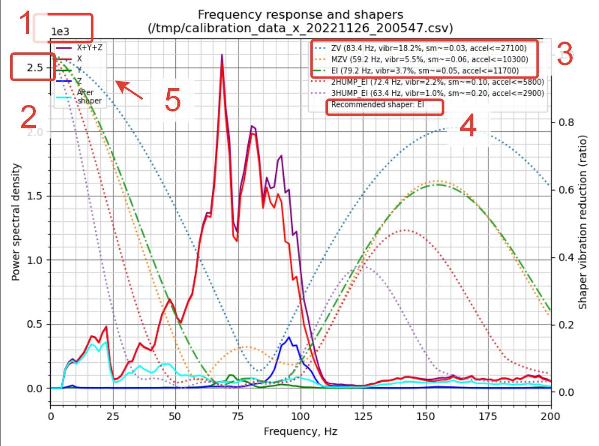

**Как перестать беспокоится и научится читать графики акслерометра**

после того как вы получили график теста по осям нужно понять есть ли у вас проблемы, какие они и можно применять шейперы которые вам порекомендовал автокалибровщик.

1. размерность. грубо говоря в какой степени количество ноликов в наших вершинках. тоесть если написано 1е3 это 1000 если 1е5 это 100000 
2. высота вершинок множим на размерность.. 
3. предлагаемые шейперы автокалибровщиком. имя шейпера, частота шейпера. процент остаточных вибраций после его применения.  Сглаживающее время. и ускорение. 
4. предлагаемый шейпер автокалибровщиком.
5. цветом обозначены графики по осям, отдельного внимания стоит голубая линия - предпологаемый график после применения шейперов.
   
   Теперь подробробнее по каждому из пунктов.  

   1. Главная ошибка которую вы можете допустить это игнорировать размерность. график может выглядет красивым и близким к идеалу только потому что настолько огромен что остальные недостатки просто тонут в его высоте. и наоборот при размерностях 1е2-1е3 небольшие шероховатости могут выглядеть  огромными проблемами. 
   2. менее важный параметр но все равно 8 больше чем 1 и это надо учитывать в сравнении если вы делает несколько замеров после исправлений. 
   3. Выбор шейпера. первое на что я обращаю внимание это процент остаточных вибраций. он должен быть близким к нулю или быть равен нулю. второе это разрыв в ускорении первого шейпера и последующих.. например первый шейпер 27100 а второй 10300 это снижение в более чем два раза, значит что проблема есть, вне зависимости что нарисовано на графике, толку не будет. при шейпере скажем 12к и на ZV 9к на MZV это вполне допустимо.  если смотреть на график из первого примера. даже несмотря на то что мы видим достаточно малую размерность, мы понимаем что нормально данный принтер работать не будет. и менять частоту шейперов это как переставлять кровати в борделе, менять надо не их а работниц, а в нашем случае разбираться с кинематикой.