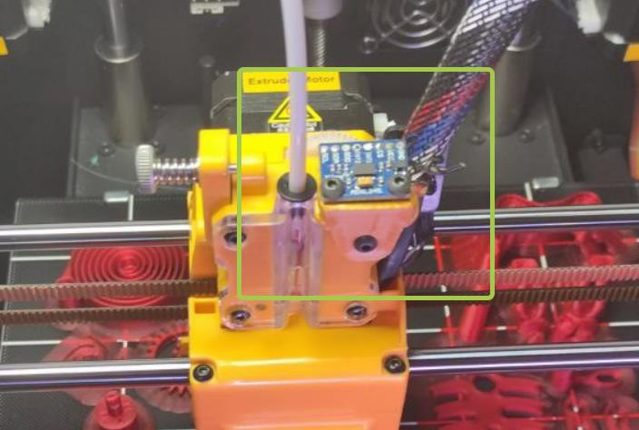
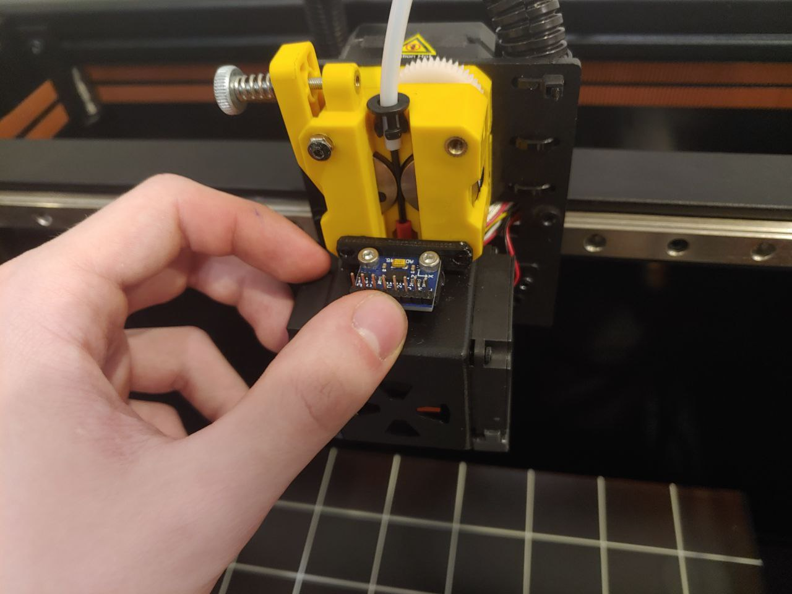

**схема подключения акселерометра**

с одной стороны видим разьем под вайфай модуль на плате принтера, с другой акселерометр


разместить можно на фидере используя данное [крепление](adxl.stl)  или это [крепление](adxl2.stl)  

для установки рекомендую схему как на фото



или  вариант 2


в ```printer.cfg``` добавить
```cfg
[adxl345]

cs_pin: PC15

axes_map: -x,y,z  # тут возможно придется править под ваше расположение осей

spi_software_sclk_pin: PB13

spi_software_mosi_pin: PC3

spi_software_miso_pin: PC2

[resonance_tester]

accel_chip: adxl345

probe_points:
  100, 100, 20
```
**установка ПО**

Заходим в консоль нашей OrangePI и пишем:
```bash
sudo apt update
sudo apt install python3-numpy python3-matplotlib libatlas-base-dev
~/klippy-env/bin/pip install -v numpy
```

Проверка настройки

Теперь вы можете проверить соединение.
 введите в консоли `ACCELEROMETER_QUERY`
Вы должны увидеть текущие измерения акселерометра, включая ускорение свободного падения, например
```
Recv: // adxl345 values (x, y, z): 470.719200, 941.438400, 9728.196800
```
Если вы получаете сообщение об ошибке, например `Invalid adxl345 id (got xx vs e5)`, где xx какой-то другой идентификатор, это указывает на проблему с подключением к ADXL345 или на неисправный датчик. Дважды проверьте питание, проводку (соответствие схеме, отсутствие оборванных или ослабленных проводов и т. д.) и качество пайки. 

Затем попробуйте запустить `MEASURE_AXES_NOISE` в консоли, вы должны получить некоторые базовые значения шума акселерометра на осях (должен быть где-то в диапазоне ~ 1-100). Слишком высокий шум по осям (например, 1000 и более) может свидетельствовать о проблемах с датчиком, проблемах с его питанием или о слишком шумных несбалансированных вентиляторах 3D-принтера.

сам акселерометр брал [тут](http://alii.pub/6hx40w) 

P.S.  Если очень захотелось подцепить 2 акселерометра  по этой схеме(например у вас ендер с платой mks) Вам достаточно второй акселерометр подключить на теже контакты кроме вывода
`CS` его необходимо  подключить `PC13` первого акселерометра и `PC15` второго акселерометра

И соответственно добавляем конфиг под второй акселерометр с учетом тестера измерений:

```
[adxl345 X]
cs_pin: PC13  # контакт акселерометра оси икс
spi_software_sclk_pin: PB13
spi_software_mosi_pin: PC3
spi_software_miso_pin: PC2
axes_map: x, y, z # не забываем править оси на нужные вам

[adxl345 Y]
cs_pin: PC15 # контакт акселерометра оси игрек
spi_software_sclk_pin: PB13
spi_software_mosi_pin: PC3
spi_software_miso_pin: PC2
axes_map: x,z,y  # не забываем править оси на нужные вам

[resonance_tester]
accel_chip_x: adxl345 X
accel_chip_y: adxl345 Y
probe_points:    125, 100, 20  # an example
```
