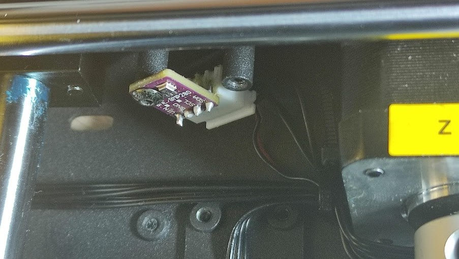
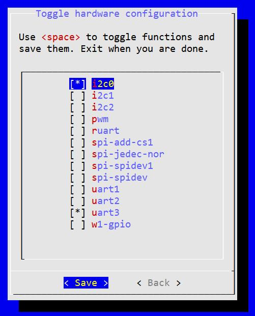
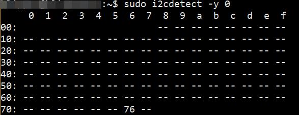
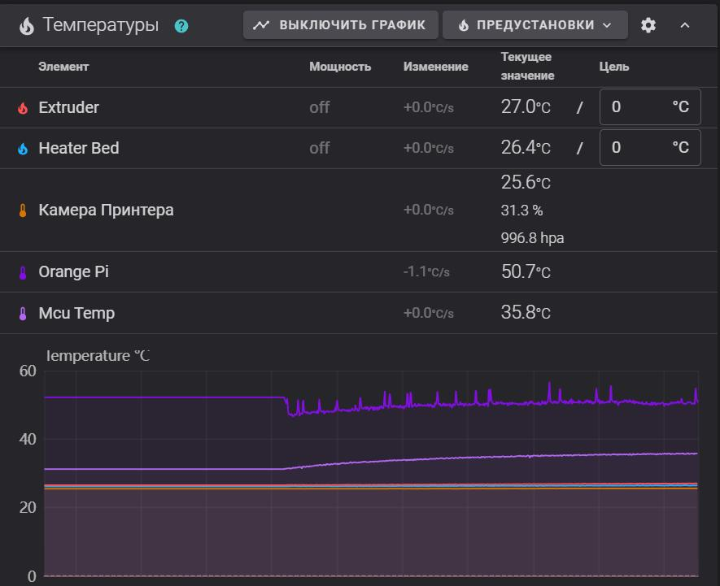

<h2>Подключение датчика температуры BME280</h2>

*update* [второй способ подключения](../i2c_mcu/readme.md)

При одинаковом названии есть два вида датчика, на 3.3 вольта и на 5 вольт. 
3.3 имеет 6 контактов и подключается как по i2c так и по spi, а вот версия на 5 вольт только по i2c.


в принтере есть датчик огня которые обычно не подключают и на его место bme280 прекрасно подойдет если хост расположен внутри корпуса как у меня.



необходимо протянуть дополнительный провод от хоста до датчика. 

1-VCC — питание модуля 5 В;

2-GND —  Земля (Ground);

3-SCL — линия тактирования (Serial CLock);

4-SDA — линия данных (Serial Data).

на orange pi 3lts подключим их в 4 6 5 3 разъем соответсвенно


 это было самое легкое. 

<h3>Настройка шины I2c</h3>
Запустим утилиту конфигурирования платы:  <b>armbian-config</b>. Перейдем по меню: System > Hardware, и включим <b>I2C0</b> после сохраняем, перегружаемся



проверяем что работает

```bash
sudo i2cdetect -y 0
```
Шина I2C работает и датчик BME280 по адресу 0x76 найден 


Добавим пользователю возможность чтения шины i2c

```bash
 sudo usermod -aG i2c Имя_пользователя_поставь_свое
 ```
 Проверяем:

```bash
 id
 ```
 Должно быть что то похожее на это - ```uid=1000(klipper) gid=1000(klipper) группы=1000(klipper),5(tty),20(dialout),27(sudo),44(video),115(i2c)```

 <h3>Настройка Host</h3>
 Для использования orange pi как MCU с целью получения доступа к его шинам SPI, i2c и просто к GPIO, необходимо установить и запустить исполняемый модуль Klipper и на нем.

Для этого необходимо чтобы исполняемая часть MCU на orange pi запускалась раньше, чем загрузится Klipper, для этого выполняем следующие действия:

```bash
cd ~/klipper/
sudo cp ./scripts/klipper-mcu.service /etc/systemd/system/
sudo systemctl enable klipper-mcu.service
```

Действиями выше, был создан новый элемент автозапуска, и добавлен в скрипты загрузки.

Далее необходимо создать прошивку для Orange PI контроллера, для этого выполняем:

```bash
cd ~/klipper/
make menuconfig
```

В меню конфигурации, следует выбрать архитектуру процессора как Linux process, нажимаем Q и сохраняем изменения.
Теперь установим исполняемую часть на Orange PI:
```bash
make
sudo service klipper stop
make flash
sudo service klipper start
```


Теперь необходимо внести изменения в printer.cfg, чтобы Klipper смог получить доступ к MCU Orange PI
```cfg
[mcu host]
serial: /tmp/klipper_host_mcu
```
После выполнения этих действий и перезагрузки Orange PI вы получите доступ к шинам и GPIO вашего одноплатного компьютера.

чтобы датчик отображался добавим его в конфиг и добавим маленький макрос на будущее.
```cfg
[temperature_sensor Камера_принтера]
sensor_type: BME280
i2c_address: 118
i2c_mcu: host
i2c_bus: i2c.0

[gcode_macro QUERY_BME280]
gcode:
    
    {action_respond_info(
        "Температура: %.2f C\n"
        "Давление: %.2f Миллибар\n"
        "Влажность: %.2f%%" % (
            sensor.temperature,
            sensor.pressure,
            sensor.humidity))}```
```


настройка i2c основана на этом мануале https://devdotnet.org/post/rabota-s-gpio-v-linux-na-primere-banana-pi-bpi-m64-chast-5-device-tree-overlays-shina-i2c-podkyuchenie-datchikov-bosh-bmx/
покупал датчик [тут] (http://alii.pub/6hx44l)
