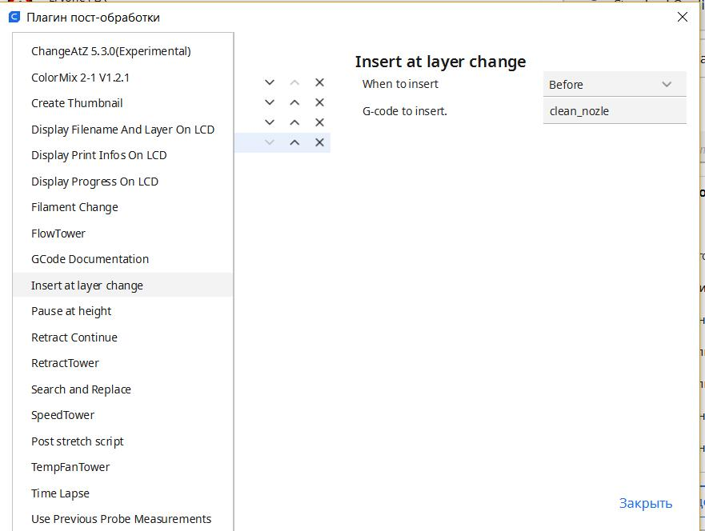

**Чистка сопла** - только для стоковой головы.
перед началом печати можно немножко почистить сопло от вытекающего филамента.


распечатываем 
[держатель щетки](shetka_3d.STL)

монтируем:


В ```printer.cfg``` добавляем:


 ```gcode
 [gcode_macro Clean_nozle]
gcode:
    G1 X1 Y20 F10000 
    G1 X1 Y130 F10000
    G1 X1 Y70 F10000
    G1 X1 Y130 F10000
    G1 X1 Y70 F10000
    G1 X1 Y130 F10000
    G1 X1 Y20 F10000
 ```
 
 
Теперь в начальный код слайсера можно просто вписать Clean_nozle  например так:
```
M220 S100 ;сброс скорости подачи
M221 S100 ;сброс расхода
G90 ;использовать абсолютные координаты
M82 ;режим абсолютного выдавливания
G28 ;дом

clean_nozle ; чистка сопла(макрос)

G1 Z2 F1500 ;поднять z
G92 E0 ;сброс экструдера
G1 X75 Y5 F5000 ;начальное положение
G1 Z0.28 F1500 ;нижняя z
G1 E4 F500 ;заправить нить
G1 X180 E10 F500 ;1-я линия
G1 Y5.4 F5000
G1 X75 E20 F500 ;2-я линия
G1 Z2 F1500 ;поднять z
G92 E0 ;сброс экструдера
```
  
Саму щетку брал [тут](http://alii.pub/6hz9dc) обрезал оставив самое важное. 


**Пы. Сы.**  Если вам мало почистить щетку только перед печатью, первое, я лично советую разобраться с затяжкой сопла, посмотреть и при необходимости заменить на качественное. проверить ретракты. но, если очень хочется упороться в чистоту или сильно специфический пластик, то пожалуйста: 

я буду показывать на cura а вы уж там сообразите..
1. ищем в слайсере постобработку кода.
   

2. добавляем наш макрос к каждому началу слоя макрос `clean_nozle` в строку `G-code insert:`
   

Если вы покупали щетку по моей ссылке то латунью о латунь вы сопло о щетку не сотрете конечно, но если сопельки надо подтирать слишком часто, стоит задуматься о том, что причина в чем то другом.

**Дополнение.**

 Код можно добавить в скрипт паузы. тогда если видите что в процессе печати налипает пластик на сопло, можно просто нажать паузу и скрипт выполнит очистку сопла.

 в конфиге ищем скрипт RESUME. при постановке на паузу голова отьедет как и раньше. а вот при нажатии RESUME, перед печатью, выполниться скрипт очистки, что логичнее, за время паузы пластик может натечь.. и лучшее время его убрать именно перед печатью.  


```gcode
[gcode_macro RESUME]
rename_existing: BASE_RESUME
gcode:
    
    G91
    G1 E{E} F2100
    G90
    RESTORE_GCODE_STATE NAME=PAUSE_state MOVE=1
    BASE_RESUME
```

и меняем его на 
```gcode
[gcode_macro RESUME]
rename_existing: BASE_RESUME
gcode:
    CLEAN_NOZLE
    
    G91
    G1 E{E} F2100
    G90
    RESTORE_GCODE_STATE NAME=PAUSE_state MOVE=1
    BASE_RESUME
```