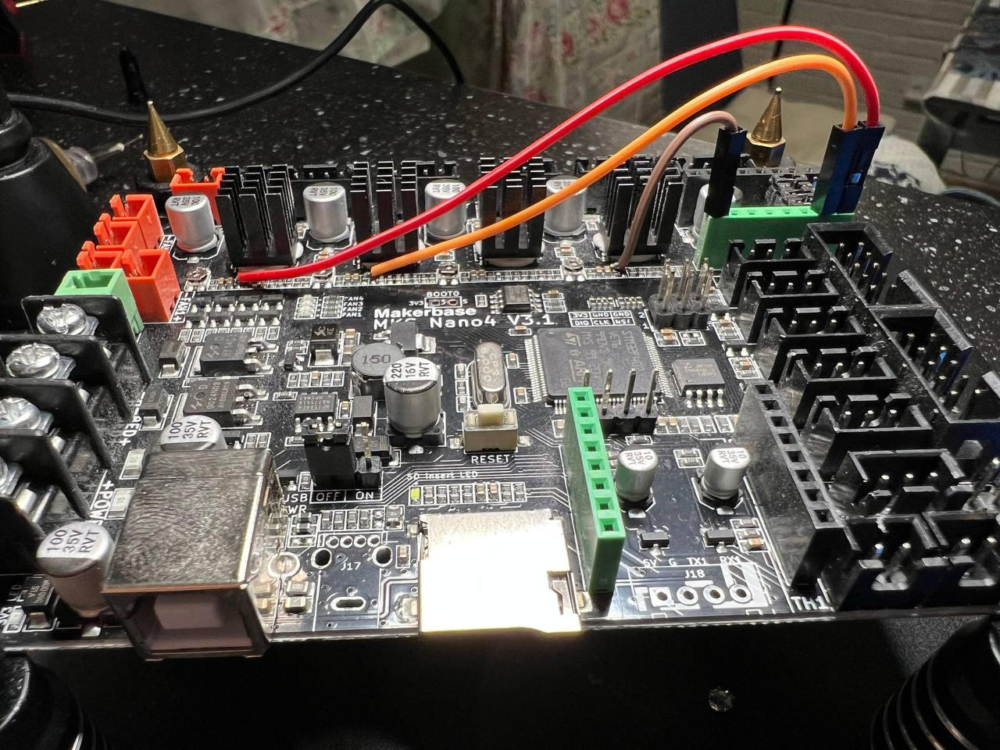

Coneccion de los drivers UART

Los drivers por defecto en modo silencioso.Todo lindo,solo que a las velocidades por arriba de 100 empiezan a hacer ruido y gritar como locos.Claro que se puede imprimir a la velocidad de 300 y no prestar atencion,pero se puede hacer soldaduras por UART y desactivar este modo. Aca esta el ejemplo antes y despues... -mirar con sonido.

https://user-images.githubusercontent.com/59514540/202737043-5a83339d-8136-49bd-a743-e7dec3daad25.mp4


https://user-images.githubusercontent.com/59514540/202737096-bd7b8f84-f78c-458d-82d0-08003b43714e.mp4


mejor consulte al profecional! (se lo adverti)
Desoldar las resistencias (metodo viejo,se puede no desoldar nada) y soldar los cables como se indica en la foto

ATENCION! despues de soldar cubra el lugar de la soldadura con termopegamento,ya que por la vibracion los cables pueden despegar las pistas.

En `printer.cfg` agregamos `[include tmc.cfg]` ¨copiamos el archivo [tmc.cfg](tmc.cfg) a la carpeta te 
clipper al lado del archivo `printer.cfg`
Es necesario corregir microstep en las configuraciones de la imresora y configurar los pasos del extructor,en este momento una parte de mi printer.cfg se ve asi:

```cfg
[stepper_x]
step_pin: PE3
dir_pin: !PE2
enable_pin: !PE4
microsteps: 16
rotation_distance: 40
endstop_pin: !PA15
position_endstop: 1
position_max: 255
homing_speed: 40

[stepper_y]
step_pin: PE0
dir_pin: !PB9
enable_pin: !PE1
microsteps: 16
rotation_distance: 40
endstop_pin: !PD2
position_endstop: 1
position_max: 220
homing_speed: 40


[extruder]
step_pin: PD6
dir_pin: PD3
enable_pin: !PB3
microsteps: 16
rotation_distance: 7.839
max_extrude_only_distance: 1400.0
nozzle_diameter: 0.400
filament_diameter: 1.750
heater_pin: PE5
sensor_type: Generic 3950
sensor_pin: PC1
#control: pid
#pid_Kp: 14.669
#pid_Ki: 0.572
#pid_Kd: 94.068
min_temp: 0
max_temp: 320
pressure_advance = 0.022
```
Como por ahora no tengo conectado el eje Z por UART (esto no hace falta en 99.9% de los casos).Su configuracion no esta descripta aca para no confundirlos.Su propia configuaracion del eje Z la dejamos por defecto.Presten atencion que los numeros en sus impresoras pueden ser diferentes.El coeficiente pressure_advance es una configuracion aproximada que para ustedes no significa nada,configurenla ustedes mismos.


Si hacen todo de forma correcta tiene que salir asi:



P.S. DEspues de que ustedes hicieron todas estas operaciones y empezaron a imprimir van a escuchar ruidos extraños y fuertes al imprimir las primeras capas a baja velocidad. Ypor que esta pasando esto?

Por defecto los drivers estan conectados en "modo silencioso" llamado stealthChop justamente este "modo silencioso" producia el ruido a la velocidad elevada y despues de conectarse por la UART ustedes pasaron a modo spreadCycle, que es rapido y mas precizo que puede hacer ruido a las velocidades bajas. Hay configuracion para cada uno de los motores para activar el "modo silencioso"... Se podria activarlo,la documentacion describe que a las velocidades mas bajas que las establecidas estos modos se activan entre ellos... Pero.......

Voy a citar la pagina oficial de Clipper: "Siempre se recomienda utilizar el modo «spreadCycle» (sin declarar stealthchop_threshold) o utilizar siempre el modo «stealthChop» (configurando stealthchop_threshold al valor de 999999). Lamentablemente los drivers a menudo dan los resultados malos y confusos si el modo cambia cuando la velocidad del motor no es igual al 0".

Por eso en algun momento vamos a poner stealthchop_threshold: 120 y a la velocidad mas baja que 120mm/s el driver pasara al "modo silencioso", pero esto no va a pasar ni hoy ni en los proximos tiempos.

Que tenemos que hacer? Aprender aimprimir a las velocidades que no fueron impuestas por los "ancianos",sino utilizar los shapers para compensar las resonancias y Pressure advance.Y hasta el ruido este pequeño aparentemente se va a aparecer solamente en las capas primarias