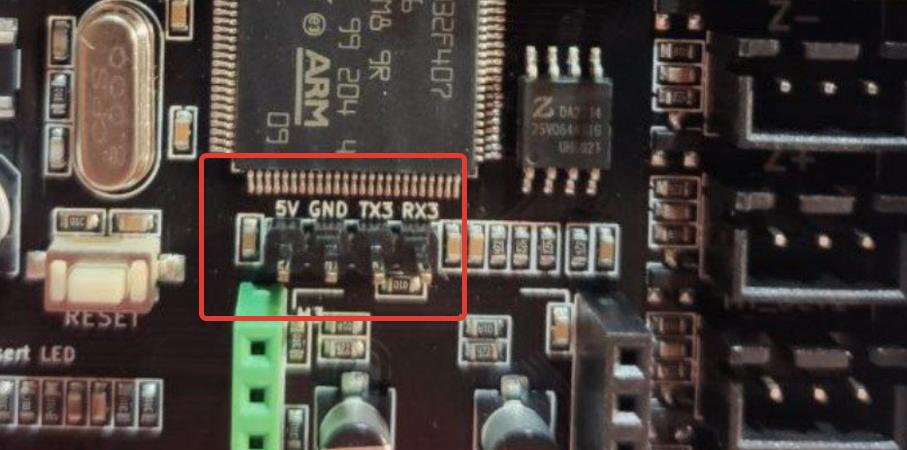

**Подключение i2c датчиков к плате принтера**

Во время печати трудно переоценить значение датчиков. Температура, влажность, все эти параметры влияют на качество печати.
я уже писал статью по применению датчика [BME280](../bme280/readme.md) но там подключение шло к микрокомпьютеру, у каждого своя операционная система, разные пины,  есть вариант изящнее и во многом проще. Для этого вам нужен только сам датчик немного проводов и небольшая добавка в `printer.cfg`.

*если на датчике написано что он может работать от 3 до 5 вольт, я советую выбрать напряжение больше для увеличения стабильности работы*

Практически все датчики имеют 4 пина это VCC(3-5 вольт) GND(земля) SDA(шина данных) SCL(опорная шина) на плате принтера есть UART3 он находится рядом с разъемом WIFI. 



5V GND TX=PB10=SCL RX=PB11=SDA

Ну а теперь все просто подключаете ваш датчик согласно пинам. SDA датчика к RX, SCL датчика к TX на плате и питание, 5 вольт и земля.  

конфиги для датчиков(в любом месте вашего `printer.cfg`):

**BME280** [купить тут](https://alii.pub/6mct88)
```
[temperature_sensor Камера_принтера]
sensor_type: BME280
i2c_address: 118
i2c_bus: i2c2
```
**LM75A** [купить тут](https://alii.pub/6mct90)
```
[temperature_sensor LM75A]
sensor_type: LM75
i2c_address: 72
i2c_bus: i2c2
```

**HTU21D** [купить тут](https://alii.pub/6mctad)

```
[temperature_sensor HTU21D]
sensor_type: HTU21D
i2c_address: 64
i2c_bus: i2c.2
```
После `temperature_sensor` можно вписать произвольное имя. как в первом примере.
 
 После сохранение и перезагрузки получим примерно такую картинку:

 

 для lm75 датчика температуры есть интересное применение если его разместить в камере принтера то с помощью него можно управлять кулером на корпусе. если честно этот кулер бесполезная примочка, но если вам очень хочется то добро пожаловать в референсы клиппера.  к сожалению ни ht21d ни BME280 не могут быть использованы для управления чем либо.

Также надо заметить что к одной шине SCL\SDA можно подключать несколько датчиков. На данный момент нет возможности проверить. согласно мануала подключаются они паралельно, но на всех датчиках кроме первого необходимо выпаять подтягивающие резисторы. 

