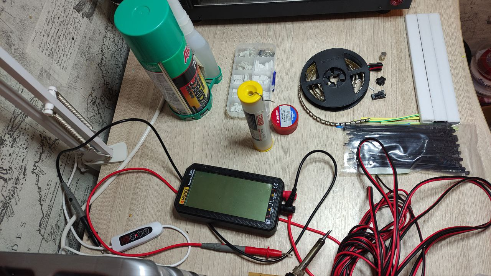
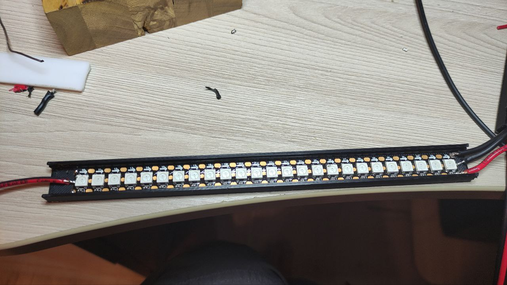
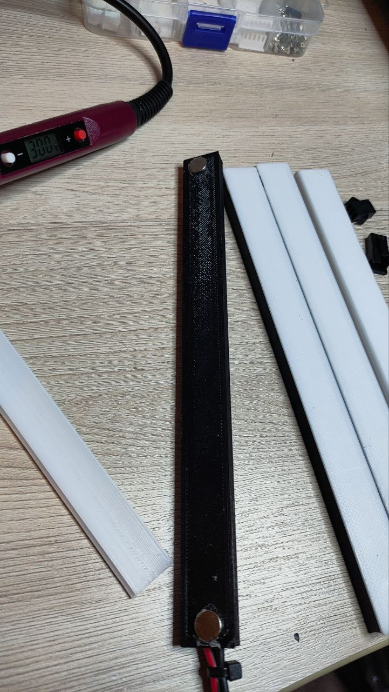
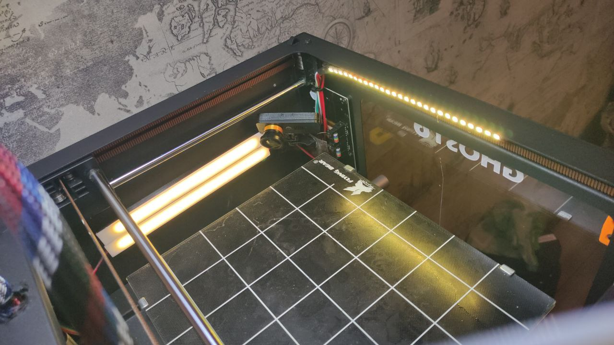
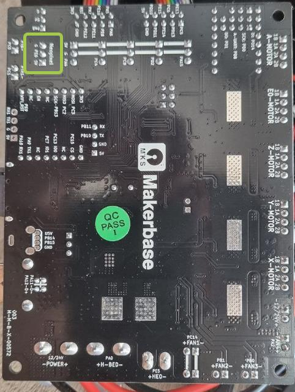
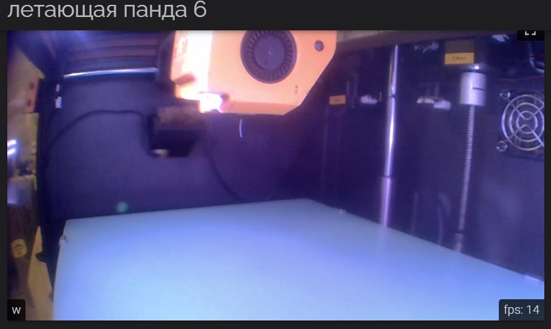

**Установка адресной светодиодной ленты.** 

Недостатки штатной ленты принтера ясны каждому владельцу, черный цвет стенок, 
темная поверхность ультрабазы, эффективно поглощают свет и рассмотреть что-то, даже в свете ленты, которая светит абы как, достаточно проблематично.
К сожалению компактность корпуса и необходимость снимать боковую крышку сдвигом вниз, в случае нужды доступа к плате принтера, не позволяют закрепить ленты.
Поэтому решение комплексное и довольно накладное. первая часть описана в разделе  [placement](https://github.com/Tombraider2006/klipperFB6/tree/main/placement)  которая позволяет установить дополнительный блок питания и хост внутри корпуса.
 Вторая часть это подключение адресной ленты. для этого есть штатный разьем неопиксель *PE6* на плате. в который воткнута штатная подсветка, его и используем. 
 у меня было несколько этапов и я сделал два канала подключения. я задействовал штатный разьем для подключения подсветки в голову экструдера,
 а основной свет запитал из разьема 3d-touch *PA8* который все равно некуда сунуть с нашей компоновкой. Я опишу штатный случай и все дальнейшие инструкции для штатного разъема.
 
  **немного теории**
 
  Команды в ленте передаются от диода к диоду, паровозиком.
  У ленты есть начало и конец, направление движение команд на некоторых моделях указано стрелочками.
  Для примера рассмотрим ws2812b, у нее три контакта. Два на питание, а вот третий в начале ленты называется DI (digital input), а в конце – DO (digital output).
  Лента принимает команды в контакт DI! Контакт DO нужен для подключения дополнительных кусков ленты или соединения матриц.
  
  Если в схеме возможна ситуация, при которой на ленту не будет подаваться питание 5V,
  но будет отправляться сигнал с микроконтроллера – лента начнёт питаться от дата-пина.
  В этом случае может сгореть как первый светодиод в ленте, так и пин контроллера.
  Не испытывайте удачу, поставьте резистор с сопротивлением 200-500 Ом.
  Точность резистора? Любая. Мощность резистора? Любая. Да, даже 1/4.
  
   Самый важный пункт, который почему то все игнорируют: цифровой сигнал ходит по двум проводам, 
   поэтому для его передачи одного провода от ардуины мало. Какой второй? Земля GND.
  
  *Питание.* Один цвет одного светодиода при максимальной яркости кушает 12 миллиампер. 
  В одном светодиоде три цвета, итого ~36 мА на диод. 
  Пусть у вас есть метр ленты с плотностью 60 диод/метр,
  тогда 60на36 = 2.1 Ампера при максимальной яркости белого цвета, соответственно нужно брать БП, 
  который с этим справится. Также нужно подумать, в каком режиме будет работать лента. 
 
 Продолжая тему питания, хочу отметить важность качества пайки силовых точек (подключение провода к ленте, подключение этого же провода к БП), а также толщину проводов. Как показывает опыт, брать нужно провод сечением минимум 1.5 квадрата, если нужна полная яркость. Пример: на проводе 0.75 кв.мм. на длине 1.5 метра при токе 2 Ампера падает 0.8 вольта, что критично для 5 вольт питания. Первый признак просадки напряжения: заданный программно белый цвет светит не белым, а отдаёт в жёлтый/красный. Чем краснее, тем сильнее просело напряжение!
 
 *маленький лайфхак - если вы хотите просто попробовать и подключить только кусок ленты вместо штатного, то можно просто задействовать три провода от штатного места и избежать всех плясок с бубном с понижайкой и блоком питания. расчет простой если брать по моей ссылке это 0.2 ватта на диод. ватты это произведение тока на вольтаж. тоесть суммируем количество диодов получаем ватты делим на напряжение, если результат больше чем 0.5 Ампера идём за понижайкой или БП. В нашем случае не больше 12 светодиодов. Но это баловство, а не улучшение принтера* 

 
 **материалы и инструменты**
 
 
 
 Нам понадобится:
 
 Распечатанные модели держателей ленты  [тыц](2_long_190mm.stl) и [тыц](1_long_190mm.stl)  
 
 лента RGB 5v [например тут](http://alii.pub/6hwuel) 144 диода на метр  
 
 магниты неодимовые небольшие [например такие](http://alii.pub/6hwuj9)
 
 провода минимум сечения 0.5
 
 паяльник, припой, стяжки, кусачки, мультиметр, клей (суперклей или похожий)
 
 **Монтаж**

необходимо продумать как и где у вас будут стоять ленты чтобы паравозик сигнального провода не болтался в воздухе и по максимуму был коротким. 

У меня порядок такой: от платы к верхнему штатному месту, от него вниз к боковой стенке, от первой планке ко второй. был еще конец который уходил в правый угол но мне не понравилось как он светит и я его убрал. возможно верну позже.





 Питание к ленте может подходить с любой стороны, хоть посреди ленты, а вот сигнальный провод строго паравозиком по стрелкам, у меня получилось запихать в один корпус 25 светодиодов и 27 на место штатной ленты. Площадку при пайке можно легко оторвать и поэтому на одной из лент у меня 24 светодиода)
 На штатное место подсветки модель площадки которую я дал **не подходит!** ее задевает голова, поэтому я ее просто приклеил на суперклей.
 

на плате не все так очевидно, посмотрите контакты остальных разьемов и контакты неопикселя..  итак нам нужны GND и PE6 

 

подключаем их первой ленте и там же подключаем питание от блока питания.  дальше тянуть землю от платы не надо.  если вы соеденили GND платы и GND блока питания ранее то достаточно PE6

Дальше работа паяльником, клеем и укладка проводов, уверен, у вас получится красивиее чем у меня)

**Конфигурирование** 

В ```klipper.cfg``` необходимо найти и раскомментировать или вписать заново следующие строки. не забудьте закоментировать старые про стоковую ленту

```g-code
[neopixel my_neopixel] # вместо my_neopixel можете написать свое имя только вместо пробела, если он у вас будет в имени, используйте подчеркивание и не забудьте поменять имя в макросах.
pin: PE6 # наш пин 
chain_count: 75 #количество светодиодов всего во всей ленте
color_order: GRB

initial_RED: 0.5 # начальные значения при включения, у меня желтый цвет на половинной яркости 
initial_GREEN: 0.5
initial_BLUE: 0.0
initial_WHITE: 0.5
```

Теперь можно похулиганить. 

Добавим пару макросов
первый добавит макрос  PartyTime с ним ваши светодиоды будут красиво моргать разными цветами, расписано на 27 светодиодов. Можете заняться и расширить дальше методом индусского кода или написать свой) 

*важное замечание* добавьте этот макрос в часть неисполняемых при печати или просто не нажимайте его во время печати, это вызовет паузу печати на время выполнения макроса. "вот три раза написал "печати" и все равно найдется умник который нажмет...*

```g-code
[gcode_macro PartyTime]
gcode:
    
        SET_LED LED=my_neopixel RED=0.0 GREEN=0.0 BLUE=0.5 INDEX=1 TRANSMIT=0
        SET_LED LED=my_neopixel RED=0.0 GREEN=0.0 BLUE=0.5 INDEX=2 TRANSMIT=0
        SET_LED LED=my_neopixel RED=0.0 GREEN=0.0 BLUE=0.5 INDEX=3 TRANSMIT=0
        SET_LED LED=my_neopixel RED=0.0 GREEN=0.0 BLUE=0.5 INDEX=4 TRANSMIT=0
        SET_LED LED=my_neopixel RED=0.0 GREEN=0.0 BLUE=0.5 INDEX=5 TRANSMIT=0
        SET_LED LED=my_neopixel RED=0.0 GREEN=0.0 BLUE=0.5 INDEX=6 TRANSMIT=0
        SET_LED LED=my_neopixel RED=0.0 GREEN=0.0 BLUE=0.5 INDEX=7 TRANSMIT=0
        SET_LED LED=my_neopixel RED=0.0 GREEN=0.0 BLUE=0.5 INDEX=8 TRANSMIT=0
        SET_LED LED=my_neopixel RED=0.0 GREEN=0.0 BLUE=0.5 INDEX=9 TRANSMIT=0
        SET_LED LED=my_neopixel RED=0.0 GREEN=0.5 BLUE=0.0 INDEX=10 TRANSMIT=0
        SET_LED LED=my_neopixel RED=0.0 GREEN=0.5 BLUE=0.0 INDEX=11 TRANSMIT=0
        SET_LED LED=my_neopixel RED=0.0 GREEN=0.5 BLUE=0.0 INDEX=12 TRANSMIT=0
        SET_LED LED=my_neopixel RED=0.0 GREEN=0.5 BLUE=0.0 INDEX=13 TRANSMIT=0
        SET_LED LED=my_neopixel RED=0.0 GREEN=0.5 BLUE=0.0 INDEX=14 TRANSMIT=0
        SET_LED LED=my_neopixel RED=0.0 GREEN=0.5 BLUE=0.0 INDEX=15 TRANSMIT=0
        SET_LED LED=my_neopixel RED=0.0 GREEN=0.5 BLUE=0.0 INDEX=16 TRANSMIT=0
        SET_LED LED=my_neopixel RED=0.0 GREEN=0.5 BLUE=0.0 INDEX=17 TRANSMIT=0
        SET_LED LED=my_neopixel RED=0.0 GREEN=0.5 BLUE=0.0 INDEX=18 TRANSMIT=0
        SET_LED LED=my_neopixel RED=0.5 GREEN=0.0 BLUE=0.0 INDEX=19 TRANSMIT=0
        SET_LED LED=my_neopixel RED=0.5 GREEN=0.0 BLUE=0.0 INDEX=20 TRANSMIT=0
        SET_LED LED=my_neopixel RED=0.5 GREEN=0.0 BLUE=0.0 INDEX=21 TRANSMIT=0
        SET_LED LED=my_neopixel RED=0.5 GREEN=0.0 BLUE=0.0 INDEX=22 TRANSMIT=0
        SET_LED LED=my_neopixel RED=0.5 GREEN=0.0 BLUE=0.0 INDEX=23 TRANSMIT=0
        SET_LED LED=my_neopixel RED=0.5 GREEN=0.0 BLUE=0.0 INDEX=24 TRANSMIT=0
        SET_LED LED=my_neopixel RED=0.5 GREEN=0.0 BLUE=0.0 INDEX=25 TRANSMIT=0
        SET_LED LED=my_neopixel RED=0.5 GREEN=0.0 BLUE=0.0 INDEX=26 TRANSMIT=0
        SET_LED LED=my_neopixel RED=0.5 GREEN=0.0 BLUE=0.0 INDEX=27 TRANSMIT=1
	G4 P250                       ; пауза 250ms
        SET_LED LED=my_neopixel RED=0.5 GREEN=0.0 BLUE=0.0 INDEX=1 TRANSMIT=0
        SET_LED LED=my_neopixel RED=0.5 GREEN=0.0 BLUE=0.0 INDEX=2 TRANSMIT=0
        SET_LED LED=my_neopixel RED=0.5 GREEN=0.0 BLUE=0.0 INDEX=3 TRANSMIT=0
        SET_LED LED=my_neopixel RED=0.5 GREEN=0.0 BLUE=0.0 INDEX=4 TRANSMIT=0
        SET_LED LED=my_neopixel RED=0.5 GREEN=0.0 BLUE=0.0 INDEX=5 TRANSMIT=0
        SET_LED LED=my_neopixel RED=0.5 GREEN=0.0 BLUE=0.0 INDEX=6 TRANSMIT=0
        SET_LED LED=my_neopixel RED=0.5 GREEN=0.0 BLUE=0.0 INDEX=7 TRANSMIT=0
        SET_LED LED=my_neopixel RED=0.5 GREEN=0.0 BLUE=0.0 INDEX=8 TRANSMIT=0
        SET_LED LED=my_neopixel RED=0.5 GREEN=0.0 BLUE=0.0 INDEX=9 TRANSMIT=0
        SET_LED LED=my_neopixel RED=0.0 GREEN=0.0 BLUE=0.5 INDEX=10 TRANSMIT=0
        SET_LED LED=my_neopixel RED=0.0 GREEN=0.0 BLUE=0.5 INDEX=11 TRANSMIT=0
        SET_LED LED=my_neopixel RED=0.0 GREEN=0.0 BLUE=0.5 INDEX=12 TRANSMIT=0
        SET_LED LED=my_neopixel RED=0.0 GREEN=0.0 BLUE=0.5 INDEX=13 TRANSMIT=0
        SET_LED LED=my_neopixel RED=0.0 GREEN=0.0 BLUE=0.5 INDEX=14 TRANSMIT=0
        SET_LED LED=my_neopixel RED=0.0 GREEN=0.0 BLUE=0.5 INDEX=15 TRANSMIT=0
        SET_LED LED=my_neopixel RED=0.0 GREEN=0.0 BLUE=0.5 INDEX=16 TRANSMIT=0
        SET_LED LED=my_neopixel RED=0.0 GREEN=0.0 BLUE=0.5 INDEX=17 TRANSMIT=0
        SET_LED LED=my_neopixel RED=0.0 GREEN=0.0 BLUE=0.5 INDEX=18 TRANSMIT=0
        SET_LED LED=my_neopixel RED=0.0 GREEN=0.5 BLUE=0.0 INDEX=19 TRANSMIT=0
        SET_LED LED=my_neopixel RED=0.0 GREEN=0.5 BLUE=0.0 INDEX=20 TRANSMIT=0
        SET_LED LED=my_neopixel RED=0.0 GREEN=0.5 BLUE=0.0 INDEX=21 TRANSMIT=0
        SET_LED LED=my_neopixel RED=0.0 GREEN=0.5 BLUE=0.0 INDEX=22 TRANSMIT=0
        SET_LED LED=my_neopixel RED=0.0 GREEN=0.5 BLUE=0.0 INDEX=23 TRANSMIT=0
        SET_LED LED=my_neopixel RED=0.0 GREEN=0.5 BLUE=0.0 INDEX=24 TRANSMIT=0
        SET_LED LED=my_neopixel RED=0.0 GREEN=0.5 BLUE=0.0 INDEX=25 TRANSMIT=0
        SET_LED LED=my_neopixel RED=0.0 GREEN=0.5 BLUE=0.0 INDEX=26 TRANSMIT=0
        SET_LED LED=my_neopixel RED=0.0 GREEN=0.5 BLUE=0.0 INDEX=27 TRANSMIT=1
      
	G4 P250                       ; пауза 250ms
        SET_LED LED=my_neopixel RED=0.0 GREEN=0.5 BLUE=0.0 INDEX=1 TRANSMIT=0
        SET_LED LED=my_neopixel RED=0.0 GREEN=0.5 BLUE=0.0 INDEX=2 TRANSMIT=0
        SET_LED LED=my_neopixel RED=0.0 GREEN=0.5 BLUE=0.0 INDEX=3 TRANSMIT=0
        SET_LED LED=my_neopixel RED=0.0 GREEN=0.5 BLUE=0.0 INDEX=4 TRANSMIT=0
        SET_LED LED=my_neopixel RED=0.0 GREEN=0.5 BLUE=0.0 INDEX=5 TRANSMIT=0
        SET_LED LED=my_neopixel RED=0.0 GREEN=0.5 BLUE=0.0 INDEX=6 TRANSMIT=0
        SET_LED LED=my_neopixel RED=0.0 GREEN=0.5 BLUE=0.0 INDEX=7 TRANSMIT=0
        SET_LED LED=my_neopixel RED=0.0 GREEN=0.5 BLUE=0.0 INDEX=8 TRANSMIT=0
        SET_LED LED=my_neopixel RED=0.0 GREEN=0.5 BLUE=0.0 INDEX=9 TRANSMIT=0
        SET_LED LED=my_neopixel RED=0.5 GREEN=0.0 BLUE=0.0 INDEX=10 TRANSMIT=0
        SET_LED LED=my_neopixel RED=0.5 GREEN=0.0 BLUE=0.0 INDEX=11 TRANSMIT=0
        SET_LED LED=my_neopixel RED=0.5 GREEN=0.0 BLUE=0.0 INDEX=12 TRANSMIT=0
        SET_LED LED=my_neopixel RED=0.5 GREEN=0.0 BLUE=0.0 INDEX=13 TRANSMIT=0
        SET_LED LED=my_neopixel RED=0.5 GREEN=0.0 BLUE=0.0 INDEX=14 TRANSMIT=0
        SET_LED LED=my_neopixel RED=0.5 GREEN=0.0 BLUE=0.0 INDEX=15 TRANSMIT=0
        SET_LED LED=my_neopixel RED=0.5 GREEN=0.0 BLUE=0.0 INDEX=16 TRANSMIT=0
        SET_LED LED=my_neopixel RED=0.5 GREEN=0.0 BLUE=0.0 INDEX=17 TRANSMIT=0
        SET_LED LED=my_neopixel RED=0.5 GREEN=0.0 BLUE=0.0 INDEX=18 TRANSMIT=0
        SET_LED LED=my_neopixel RED=0.0 GREEN=0.0 BLUE=0.5 INDEX=19 TRANSMIT=0
        SET_LED LED=my_neopixel RED=0.0 GREEN=0.0 BLUE=0.5 INDEX=20 TRANSMIT=0
        SET_LED LED=my_neopixel RED=0.0 GREEN=0.0 BLUE=0.5 INDEX=21 TRANSMIT=0
        SET_LED LED=my_neopixel RED=0.0 GREEN=0.0 BLUE=0.5 INDEX=22 TRANSMIT=0
        SET_LED LED=my_neopixel RED=0.0 GREEN=0.0 BLUE=0.5 INDEX=23 TRANSMIT=0
        SET_LED LED=my_neopixel RED=0.0 GREEN=0.0 BLUE=0.5 INDEX=24 TRANSMIT=0
        SET_LED LED=my_neopixel RED=0.0 GREEN=0.0 BLUE=0.5 INDEX=25 TRANSMIT=0
        SET_LED LED=my_neopixel RED=0.0 GREEN=0.0 BLUE=0.5 INDEX=26 TRANSMIT=0
        SET_LED LED=my_neopixel RED=0.0 GREEN=0.0 BLUE=0.5 INDEX=27 TRANSMIT=1

	G4 P250                       ; пауза 250ms
        SET_LED LED=my_neopixel RED=0.0 GREEN=0.5 BLUE=0.0 INDEX=1 TRANSMIT=0
        SET_LED LED=my_neopixel RED=0.0 GREEN=0.5 BLUE=0.0 INDEX=2 TRANSMIT=0
        SET_LED LED=my_neopixel RED=0.0 GREEN=0.5 BLUE=0.0 INDEX=3 TRANSMIT=0
        SET_LED LED=my_neopixel RED=0.0 GREEN=0.0 BLUE=0.5 INDEX=4 TRANSMIT=0
        SET_LED LED=my_neopixel RED=0.0 GREEN=0.0 BLUE=0.5 INDEX=5 TRANSMIT=0
        SET_LED LED=my_neopixel RED=0.0 GREEN=0.0 BLUE=0.5 INDEX=6 TRANSMIT=0
        SET_LED LED=my_neopixel RED=0.0 GREEN=0.5 BLUE=0.0 INDEX=7 TRANSMIT=0
        SET_LED LED=my_neopixel RED=0.0 GREEN=0.5 BLUE=0.0 INDEX=8 TRANSMIT=0
        SET_LED LED=my_neopixel RED=0.0 GREEN=0.5 BLUE=0.0 INDEX=9 TRANSMIT=0
        SET_LED LED=my_neopixel RED=0.5 GREEN=0.0 BLUE=0.0 INDEX=10 TRANSMIT=0
        SET_LED LED=my_neopixel RED=0.5 GREEN=0.0 BLUE=0.0 INDEX=11 TRANSMIT=0
        SET_LED LED=my_neopixel RED=0.5 GREEN=0.0 BLUE=0.0 INDEX=12 TRANSMIT=0
        SET_LED LED=my_neopixel RED=0.0 GREEN=0.5 BLUE=0.0 INDEX=13 TRANSMIT=0
        SET_LED LED=my_neopixel RED=0.0 GREEN=0.5 BLUE=0.0 INDEX=14 TRANSMIT=0
        SET_LED LED=my_neopixel RED=0.0 GREEN=0.5 BLUE=0.0 INDEX=15 TRANSMIT=0
        SET_LED LED=my_neopixel RED=0.5 GREEN=0.0 BLUE=0.0 INDEX=16 TRANSMIT=0
        SET_LED LED=my_neopixel RED=0.5 GREEN=0.0 BLUE=0.0 INDEX=17 TRANSMIT=0
        SET_LED LED=my_neopixel RED=0.5 GREEN=0.0 BLUE=0.0 INDEX=18 TRANSMIT=0
        SET_LED LED=my_neopixel RED=0.0 GREEN=0.0 BLUE=0.5 INDEX=19 TRANSMIT=0
        SET_LED LED=my_neopixel RED=0.0 GREEN=0.0 BLUE=0.5 INDEX=20 TRANSMIT=0
        SET_LED LED=my_neopixel RED=0.0 GREEN=0.0 BLUE=0.5 INDEX=21 TRANSMIT=0
        SET_LED LED=my_neopixel RED=0.5 GREEN=0.0 BLUE=0.0 INDEX=22 TRANSMIT=0
        SET_LED LED=my_neopixel RED=0.5 GREEN=0.0 BLUE=0.0 INDEX=23 TRANSMIT=0
        SET_LED LED=my_neopixel RED=0.5 GREEN=0.0 BLUE=0.0 INDEX=24 TRANSMIT=0
        SET_LED LED=my_neopixel RED=0.0 GREEN=0.0 BLUE=0.5 INDEX=25 TRANSMIT=0
        SET_LED LED=my_neopixel RED=0.0 GREEN=0.0 BLUE=0.5 INDEX=26 TRANSMIT=0
        SET_LED LED=my_neopixel RED=0.0 GREEN=0.0 BLUE=0.5 INDEX=27 TRANSMIT=1

	G4 P250                       ; пауза 250ms
    
    SET_LED LED=my_neopixel RED=0.3 GREEN=0.3 BLUE=0.3
```
второй макрос попроще. 

он включит первый макрос через пять секунд после включения принтера. 

```g-code
[delayed_gcode welcome]
initial_duration: 5. #тут можно вписать другое количество секунд (главное - точку не удаляйте)
gcode:
   PartyTime
```


**что получилось в итоге**

 
 
 
