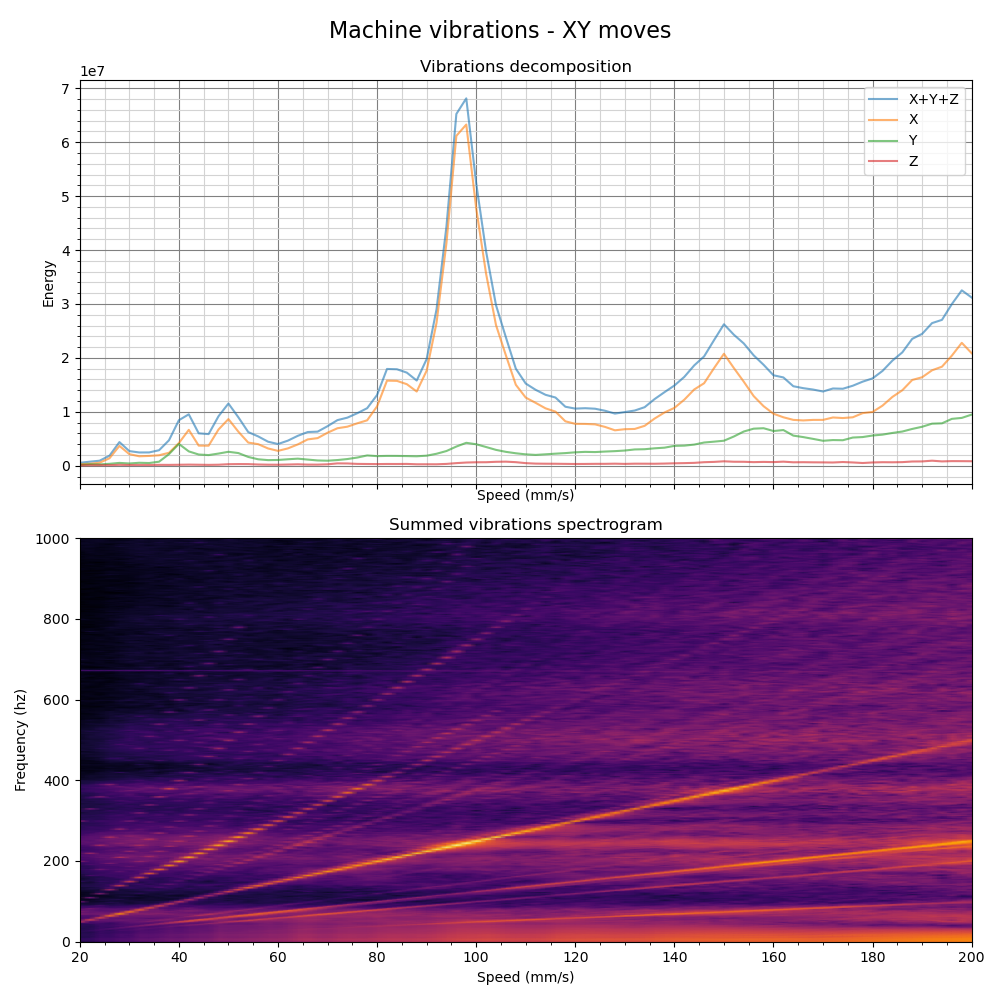

<h2>Сводный макрос по аналитике с помощью акселерометра.</h2>

**AXES_SHAPER_CALIBRATION**

Стандартная настройка шейперов. 

Возможные значения:

**VERBOSE** -обе оси(по умолчанию)

**X** - тест только оси X

**Y** - тест только оси Y

**BELTS_SHAPER_CALIBRATION**

В данном графике с помощью акселерометра тестируются ремни моторов А(X) и В(Y) цель полчуть максимально совпадающие линии ремней- это сначит ремни натянуты одинаково, и привести к максимально похожему на один пик - минимальные вибрации 

**VIBRATIONS_CALIBRATION**

Данный макрос может формировать графики шейперов, анализ равномерности натяжения ремней, а также анализ зависимости вибраций принтера от скорости передвижения, что позволяет выбрать скорости с минимальными искажениями при печати и менее шумно.

Это полностью автоматизированный рабочий процесс, который работает путем перемещения головки инструмента при использовании акселерометра:

Он выполняет последовательность движений по оси, которую вы хотите измерить, с различными настройками скорости, при этом регистрируя глобальные вибрации машины с помощью акселерометра.

Затем он вызывает автоматический скрипт, который автоматизирует несколько вещей:
он генерирует график вибраций для указанной оси с помощью пользовательского скрипта Python.
Затем он переместит график в папку результатов ADXL.

На примере этого графика мы видим что основной пик вибраций приходится на скорость около 97 мм\сек если избежать этих соростей наш принтер будет менее шумным и печать более качественная. (у вас могут быть другие значения) 

**Внимание! коректные значения этого скрипта будут только после правильной настройки шейперов.**

| параметры | значение по умолчанию | описание |
|-----------:|----------------|-------------|
|SIZE|60|размер в миллиметрах области, на которой совершаются движения|
|DIRECTION|"XY"|вектор направления, в котором вы хотите выполнить измерения. Может быть установлен на «XY», «AB», «ABXY», «A», «B», «X», «Y», «Z» |
|Z_HEIGHT|20|z высота установки головки инструмента перед началом движений. Будьте осторожны, если ваш ADXL находится под соплом, увеличьте его, чтобы избежать столкновения ADXL с станиной машины |
|VERBOSE|1|Записывать текущую скорость в консоль|
|MIN_SPEED|20|минимальная скорость инструментальной головки в мм/с для перемещений|
|MAX_SPEED|200|максимальная скорость инструментальной головки в мм/с для перемещений|
|SPEED_INCREMENT|2|приращение скорости инструментальной головки в мм/с между каждым движением|
|TRAVEL_SPEED|200|скорость в мм/с, используемая для всех перемещений|
|ACCEL_CHIP|"adxl345"|имя чипа акселерометра в конфиге|

