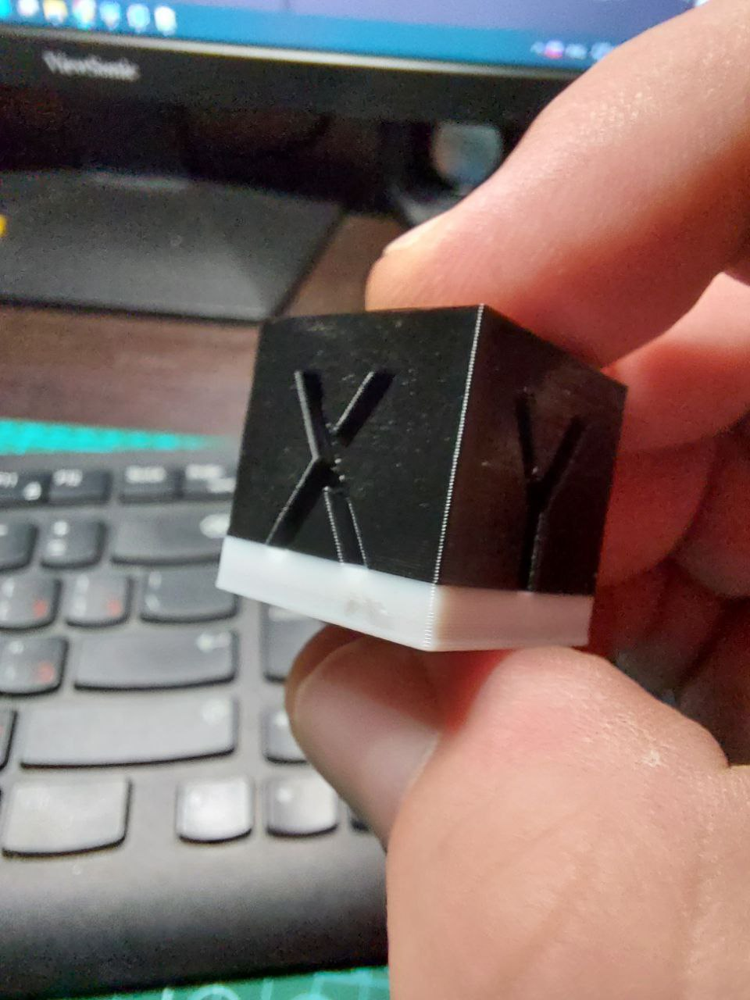
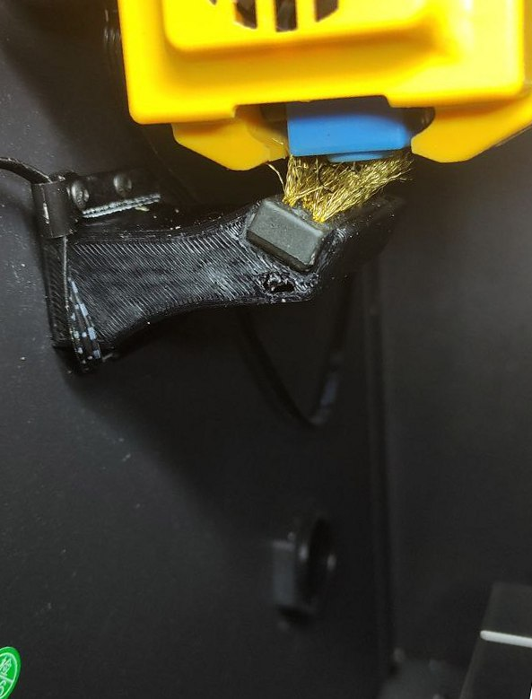

*<h2>Макросы в одном месте.</h2>*

Конечно можно пихать все макросы в основной файл `printer.cfg` но через какое то время вы там совсем потеряетесь. Поэтому лучше добавить строчку `[include имя_файла.cfg]` в любом месте вашего `printer.cfg` где всегда можно отключить или включить его. можно создать папку с макросами и сделать изящнее `[include macros/*.cfg]` и все файлы оттуда будут добавляться в вашу конфигурацию как бы вы их не назвали.

**Ahtung! Attention! Внимание!**
если есть имена например подсветки в макросе, то они должны совпадать с вашими именами в конфигурационном файле. Читайте документацию!

**Смена Филамента**

Чтобы делать полосатенькие модели например так:



[Нам  нужен этот](filament.cfg) макрос *!Настроен под голову стоковую для 6 мишки.* для biuu_h2 качаем [этот вариант](filament_biqu.cfg)

Составной макрос смены филамента. Ставит на паузу PAUSE, вызывает макрос FILAMENT_UNLOAD для выгрузки филамента, подаёт звуковой сигнал BEEP, COUNTDOWN ждёт 5 минут, пока вы заправите новый филамент в фидер, снова подаёт звуковой сигнал и FILAMENT_LOAD загружает филамент, RESUME запустит печать дальше, если макрос был вызван в процессе печати, например из G-code.

у мишки6 для   [BEEP макроса (скачиваем)](beep.cfg) используется та самая красная лампочка "ханасвист". чтобы ее активировать у вас должен быть раздел в `printer.cfg` если его нет добавляем:
```gcode
[output_pin _Zummer] 
pin: PA2 
```


**Чистка сопла** 

Этот макрос подьезжает к определенному месту и водит туда сюда по латунной щетке, [подробнее тут](../clean_nozle/readme.md) Быстро скачать [тут](clean.cfg)



**Макросы для RGB подсветки**

подробнее [тут](../led_rgb/readme.md)

Скачать одним файлом можно [тут](led.cfg)


 


[**Адаптивная сетка для стола**](https://github.com/Frix-x/klippain/blob/main/docs/features/adaptive_bed_mesh.md)

 Это почти как обычная сетка для стола, но только "где" и "когда" это необходимо. Иногда я печатаю мелкие детали, иногда печатаю целые пластины, и мне нравится получать точную кровать_сетку (например, 9x9 или больше). Однако это занимает много времени и бесполезно прощупывать всю пластину только на небольшой части посередине. Здесь помогает адаптивная сетка кровати. подробнее [тут](https://github.com/Frix-x/klippain/blob/main/docs/features/adaptive_bed_mesh.md)

 [**Измерение вибрации**](https://github.com/Frix-x/klippain/blob/main/docs/features/vibr_measurements.md)

 Описание(перевод с гита)

У меня были сильные вибрации на очень специфических скоростях на моей машине (например, 52 мм / с), и я хотел найти все эти проблемные скорости, чтобы избежать их в моем профиле слайсера и, наконец, получить бесшумную машину, о которой я мечтал!

Это полностью автоматизированный рабочий процесс, который работает путем перемещения головки инструмента при использовании акселерометра:

1. Он выполняет последовательность движений по оси, которую вы хотите измерить, с различными настройками скорости, при этом регистрируя глобальные вибрации машины с помощью акселерометра.
Затем он вызывает автоматический скрипт bash, который автоматизирует несколько вещей:
1. он генерирует график вибраций для указанной оси с помощью пользовательского скрипта Python.
Затем он переместит график и связанный с ним архив CSV в папку результатов ADXL .
1. он управляет папкой, чтобы удалить старые файлы и сохранить только набор (по умолчанию три) самых последних результатов.
2. Результаты можно найти в папке результатов ADXL , которая находится непосредственно в корне папки конфигурации, чтобы **обеспечить доступ непосредственно из вашего браузера с помощью файлового менеджера FLuidd/Maisail. SSH не нужен!**
подробнее [тут](https://github.com/Frix-x/klippain/blob/main/docs/features/vibr_measurements.md)

~~в апельсинке есть баг обработки скрипта. добавили паузу при обработке, скачать модифицированный [plot_graphs.sh](../klipper_config_my/scripts/plot_graphs.sh)~~

[**Восстановление печати после сбоя питания**](power_loss.cfg) на данный момент не проверен, стырен [тут](https://github.com/CODeRUS/klipper_config/blob/rumba32/power_loss_simple.cfg)