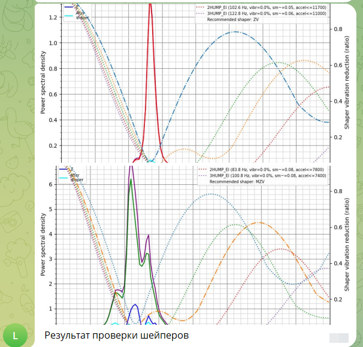

**Автоматизация теста резонансов для телеграм бота**

Если вы используете клиппер со встроенным акселерометром и когда-либо применяли тесты резонанса, вы, вероятно, хотели иметь возможность получать результаты прямо на выбранное вами устройство, а не загружать их вручную с принтера.

Благодаря возможности отправки изображений это стало реальностью, а не мечтой. Помимо клиппера и бота вам понадобится G-Code Shell Command Extension. Это позволяет выполнять команды оболочки, необходимые для выполнения соответствующего скрипта klipper python для обработки данных. 

1. Для этого необходимо запустить в консоли:

```
~/kiauh/kiauh.sh
```
выбираем 4 пункт "advanced" и там ищем "[G-Code Shell Command]" устанавливаем соглашаясь на всё) пишем "Y", выходим.


Иногда бывает проблема при копировании в windows и скрипт будет давать ошибки при попытке исполнения. 

2. тогда можно скачать его напрямую с гита к себе с помощью команды из консоли:

```
wget -P ~/printer_data/config/ https://raw.githubusercontent.com/Tombraider2006/klipperFB6/main/macros/shaper_calibrate.sh
```
Потом все равно не забудьте посмотреть и подправить путь до папки если пользователь не `pi`

**внимание! следующий текст это Второй вариант он для ознакомления и не рекомендуется!** 

2.1 *В папке с конфигами создаем файл `shaper_calibrate.sh` удобнее создать через Fluidd но это уж кому как). в него копируем следующий код:*

```
#! /bin/bash
OUTPUT_FOLDER=config/adxl_results/inputshaper
PRINTER_DATA=home/pi/printer_data
KLIPPER_SCRIPTS_LOCATION=~/klipper/scripts
RESONANCE_CSV_LOCATION=tmp
if [ ! -d  /$PRINTER_DATA/$OUTPUT_FOLDER/ ] #Check if we have an output folder
then
    mkdir /$PRINTER_DATA/$OUTPUT_FOLDER/
fi

cd /$RESONANCE_CSV_LOCATION/

shopt -s nullglob
set -- resonances*.csv

if [ "$#" -gt 0 ]
then
    for each_file in resonances*.csv
    do
        $KLIPPER_SCRIPTS_LOCATION/calibrate_shaper.py $each_file -o /$PRINTER_DATA/$OUTPUT_FOLDER/${each_file:0:12}.png # check
        rm /$RESONANCE_CSV_LOCATION/$each_file
    done
else
    echo "Something went wrong, no csv found to process"
fi
```
Не забываем исправить пользователя в строчке `PRINTER_DATA=home/pi/printer_data` если вас другое имя пользователя. 


3. через консоль сделаем файл исполняемым:

```
cd ~/printer_data/config/
chmod +x ./shaper_calibrate.sh
```

4. В `printer.cfg` добавим следущий блок:

```
[respond]

[gcode_macro telegram_shaper]
description: график шейперов в телеграм
gcode:
	 #Parse parameters
	
	
	

	 #home if not homed
		G28
	
	TEST_RESONANCES AXIS=X HZ_PER_SEC={ HZ_PER_SEC } POINT={ POSITION_X },{ POSITION_Y },{POSITION_Z}
	TEST_RESONANCES AXIS=Y HZ_PER_SEC={ HZ_PER_SEC } POINT={ POSITION_X },{ POSITION_Y },{POSITION_Z}
	RUN_SHELL_COMMAND CMD=shaper_calibrate
	RESPOND PREFIX=tg_send_image MSG="path=['/home/pi/printer_data/config/adxl_results/inputshaper/resonances_x.png', '/home/pi/printer_data/config/adxl_results/inputshaper/resonances_y.png'], message='Результат проверки шейперов' "


[gcode_shell_command shaper_calibrate]
command: bash /home/pi/printer_data/config/shaper_calibrate.sh
timeout: 600.
verbose: True
```
Обратите внимание на строчки: 

1. `RESPOND PREFIX=tg_send_image MSG="path=['/home/pi/printer_data/config/adxl_results/inputshaper/resonances_x.png', '/home/pi/printer_data/config/adxl_results/inputshaper/resonances_y.png'], message='Shaper results' "`

 и 

2. `command: bash /home/pi/printer_data/config/shaper_calibrate.sh`  
 
 если имя пользователя не `pi` меняем на своё.

Работает это следующим образом:

1. Макрос вызывается с нужными параметрами, при необходимости возвращает оси в исходное положение и приступает к стандартному тестированию шейперов по обеим осям.
   
2. Макрос вызывает выполнение сценария, который запускает программу klipper python для каждого сгенерированного файла csv. Впоследствии он удаляет файлы csv, чтобы избежать путаницы при запуске нескольких тестов один за другим. Выходные изображения помещаются в подпапку в папке журналов, чтобы вы могли легко получить к ним доступ через веб-интерфейс, если это необходимо.
   
3. Макрос завершается отправкой обоих файлов вашему телеграмм-боту. Помимо того, что бот легко доступен, теперь он может выступать в качестве вашего архива измерений.



<h2>Добавим аналитики с помощью акселерометра.</h2>

Зачем устанавливают акселерометр на 3д принтер? изначально для измерения вибраций  более точного и простого способа для определения значений инпут шейпинга. в данном макросе собраны самые полезные тесты какие можно сделать с помощью установленного акселерометра.


**telegram_BELTS_SHAPER_CALIBRATION**


В данном графике с помощью акселерометра тестируются ремни моторов А(X) и В(Y) цель полчуть максимально совпадающие линии ремней- это сначит ремни натянуты одинаково, и привести к максимально похожему на один пик - минимальные вибрации 


**telegram_VIBRATIONS_CALIBRATION**

Данный макрос может формировать графики шейперов, анализ равномерности натяжения ремней, а также анализ зависимости вибраций принтера от скорости передвижения, что позволяет выбрать скорости с минимальными искажениями при печати и менее шумно.

Это полностью автоматизированный рабочий процесс, который работает путем перемещения головки инструмента при использовании акселерометра:

Он выполняет последовательность движений по оси, которую вы хотите измерить, с различными настройками скорости, при этом регистрируя глобальные вибрации машины с помощью акселерометра.

Затем он вызывает автоматический скрипт, который автоматизирует несколько вещей:
он генерирует график вибраций для указанной оси с помощью пользовательского скрипта Python.
Затем он переместит график в папку результатов ADXL.


На примере этого графика мы видим что основной пик вибраций приходится на скорость около 97 мм\сек если избежать этих соростей наш принтер будет менее шумным и печать более качественная. (у вас могут быть другие значения) 

**Внимание! коректные значения этого скрипта будут только после правильной настройки шейперов.**

| параметры | значение по умолчанию | описание |
|-----------:|----------------|-------------|
|SIZE|60|размер в миллиметрах области, на которой совершаются движения|
|DIRECTION|"XY"|вектор направления, в котором вы хотите выполнить измерения. Может быть установлен на «XY», «AB», «ABXY», «A», «B», «X», «Y», «Z» |
|Z_HEIGHT|20|z высота установки головки инструмента перед началом движений. Будьте осторожны, если ваш ADXL находится под соплом, увеличьте его, чтобы избежать столкновения ADXL с станиной машины |
|VERBOSE|1|Записывать текущую скорость в консоль|
|MIN_SPEED|20|минимальная скорость инструментальной головки в мм/с для перемещений|
|MAX_SPEED|200|максимальная скорость инструментальной головки в мм/с для перемещений|
|SPEED_INCREMENT|2|приращение скорости инструментальной головки в мм/с между каждым движением|
|TRAVEL_SPEED|200|скорость в мм/с, используемая для всех перемещений|
|ACCEL_CHIP|"adxl345"|имя чипа акселерометра в конфиге|


<h2>Установка</h2>

 аналогична предыдущему макросу:

 копируем файл к себе в папку скриптов.

```
wget -P ~/printer_data/config/sripts/ https://raw.githubusercontent.com/Tombraider2006/klipperFB6/main/macros/plot_graphs.sh
wget -P ~/printer_data/config/ https://raw.githubusercontent.com/Tombraider2006/klipperFB6/main/macros/vibr_calibrate.cfg

```

через консоль делаем исполняемым:

```
cd ~/printer_data/config/scripts/
chmod +x ./plot_graphs.sh
```
в `printer.cfg` добавим блок:

```
[include vibr_calibrate.cfg]

[gcode_shell_command plot_graph]
command: bash /home/pi/printer_data/config/scripts/plot_graphs.sh
timeout: 500.0
verbose: True
```

Не забываем исправить пользователя в строчке `PRINTER_DATA=home/pi/printer_data` если вас другое имя пользователя.

Обратите внимание на строчки: 

1. `RESPOND PREFIX=tg_send_image MSG="path=['/home/pi/printer_data/config/adxl_results/belts/`
2. `RESPOND PREFIX=tg_send_image MSG="path=['/home/pi/printer_data/config/adxl_results/vibrations`  

в файле **vibr_calibrate.cfg** который находится в основной папке. 

