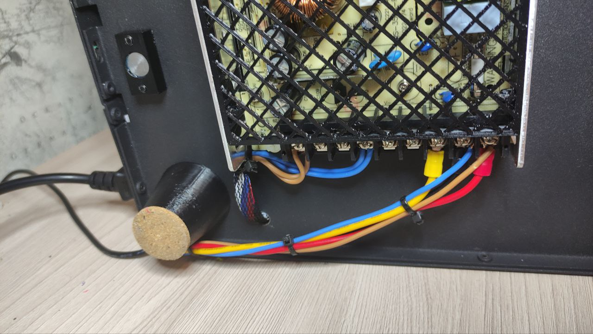

Чтобы подключить принтер к одноплатнику, чтобы ничего не торчало и выглядело хорошо я решил избавится от шумного родного блока питания и купил  
Meanwell LRS350 на 24 вольта и 350 ватт. Запас по мощности есть и главное он тоньше родного блока питания.  
далее приведу фото из которых будет почти все ясно. для питания 5 вольтовых устройств таких как LED-лента, одноплатник и прочее купил блок питания 5 вольт 30 ватт.  
сверлить пришлось только крепление для блока питания и отверстие чтобы пропустить провода от него к плате и от разьема питания сзади до самого блока питания.  
для крепления использовались винты м3 с гайками.

Для ножек принтера использвалась [эта модель](stand.stl)

Основание orange pi было закреплено через  [эту модель](case-bottom.stl)

Для того чтобы снизить шум от принтера решил убрать вентилятор обдува с принтера и вместо родной панели поставил [эту модель](Mean_Well_PSU_cover_-_fanless.stl)




После всех работ общий вид практически не изменился, а наполнение увеличилось.


[блок питания 24вольта 350 ватт](http://alii.pub/6hx4bs) 

[блок питания 5 вольт 30ватт "можно брать с 15 до 30 ватт"](http://alii.pub/6hx4dq) 

P.S.

Можно воткнуть кулер пишки вместо вентиля камеры на 24в 40х10, всё равно не нужен, переназначить датчик на пишку и назначить температуру и скорость, на 100% шумно, ну и сам датчик настроен. Можно убрать подчёркивание и он будет виден в веб-интерфейсе. добавить в `printer.cfg`:
```bash 
[temperature_fan _temp_host]
pin: PB0
max_power: 0.7
sensor_type: temperature_host
max_temp: 100
min_temp: 0
target_temp: 45
control: watermark
shutdown_speed: 0
```