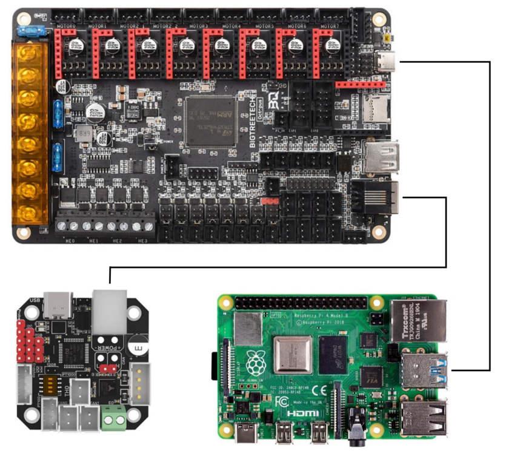
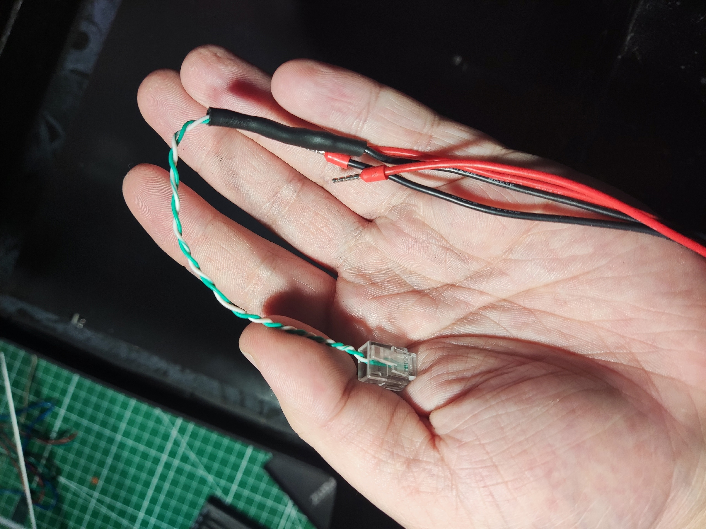
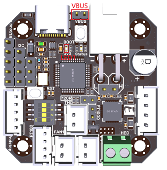
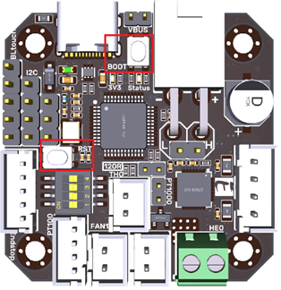
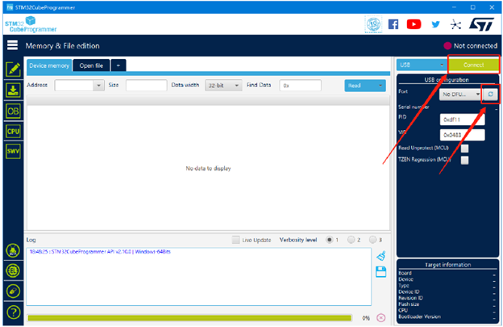
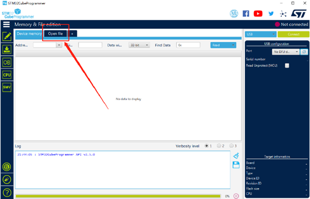
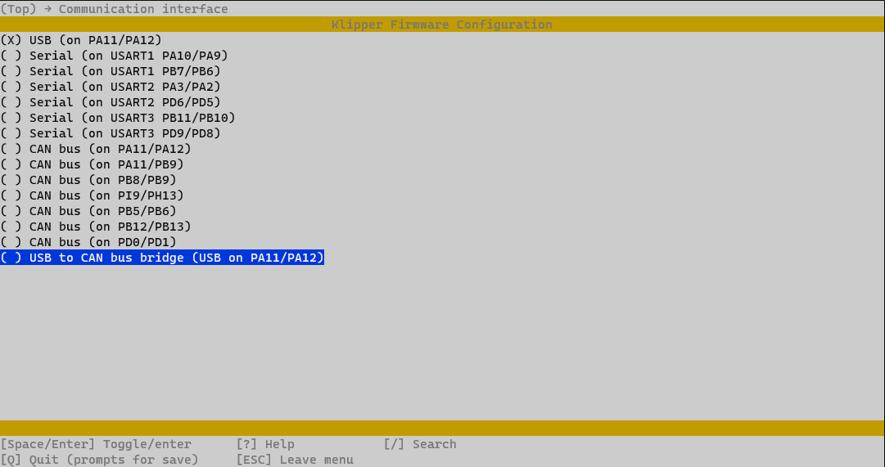
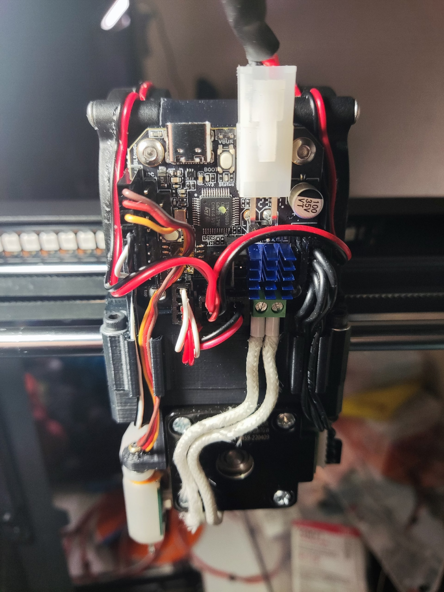

**Подключение и настройка EBB Can к плате BTT Octopus v1.1 \ Pro и аналогичным с встроенной Can шиной.**



Для реализации данной схемы нам понадобятся:
Обжимка для клемм SN-58B;
Кримпер для RJ11;
Провода сечением 0,5 кв.мм (мне с запасом хватило 2х проводов по 5м);
Кабель для шагового мотора с разьемом.
Все разъемы со стороны EBB имеются в комплекте с ним.


Мастерим кабель для подключения EBB Can
Отмеряем и отрезаем 4 провода.
Обжимаем со стороны EBB все 4 пина.


 
Так как 0,5кв.мм многожильного провода нам не обжать в разъем RJ11, необходимо соединить наши провода с витой парой любым доступным и надежным способом, например пайкой, в месте, где провода не будут двигаться. 
Обжимаем два провода Can шины в средние пины RJ11/RJ12.

Концы проводов питания желательно обжать или хотя бы залудить. Так же рекомендую завести нашу косу в змеиную кожу размера 8-10мм и использовать термоусадку во избежание перегибов и перелома жил.

 
  
Питание подключаем к 24В выходу блока питания или входу на плате соблюдая полярность (10 раз перепроверьте соответствие проводов с клеммами на EBB).


Создание прошивки для EBB36 & 42 CAN V1.1 \ V1.2
Заходим по SSH на одноплатник и вводим:
```
cd ~/klipper
make menuconfig
```

Изменяем все пункты конфигурации на:
```
[*] Enable extra low-level configuration options
Micro-controller Architecture = STMicroelectronics STM32
Processor model = STM32G0B1
Bootloader offset = No bootloader
Clock Reference = 8 MHz crystal
Communication interface = CAN bus (on PB0/PB1)
	(250000) CAN bus speed
```

После выбора конфигурации нажмите Q, чтобы выйти, и «Y», когда будет предложено сохранить конфигурацию.
Введите команды:
```
make clean
make
```

Файл klipper.bin будет сгенерирован в папке home/pi/kliiper/out. Скопируйте его на ПК с windows через WinSCP или другие программы.


Подготовьте EBB Can к прошивке установив джампер на VBUS:



Подключите EBB Can к ПК, должен включиться светодиод. В случае, если ни один светодиод не горит, попробуйте пере подключить плату в другой разъем, возможно не хватает питания. 

Установите и запустите **stm32cubeprog**   - ищется гуглом
Одновременно зажмите кнопку BOOT и нажмите на RST.


  


В программе обновите порт, выберете USB1 и нажмите Connect.


 

Нажмите на Open file и выберете файл klipper.bin, который создали ранее.
Выберете режим USB в правой части программы.
 
 
Нажмите на Download. Прошивка загрузится на EBB Can.
 


Отключите EBB Can от ПК, снимите джампер с VBUS и установите на подтягивающий резистор (красный квадрат в середине платы)
 


Подготовка MCU Octopus v1.1 \ Pro
Заходим по SSH на одноплатник и вводим:
```
cd ~/klipper
make menuconfig
```

Изменяем все пункты конфигурации на:
```
[*] Enable extra low-level configuration options
Micro-controller Architecture = STMicroelectronics STM32
Processor model = STM32F446    - (проверьте процессор на своей плате)
Bootloader offset = 32KiB bootloader
Clock Reference = 12 MHz crystal
Communication interface = USB to CAN bus bridge (USB (on PA11/PA12) 
CAN bus interface (CAN bus (on PB8/PB9))
	(250000) CAN bus speed
 ```
 

После выбора конфигурации нажмите Q, чтобы выйти, и «Y», когда будет предложено сохранить конфигурацию.
Введите команды:
```
make clean
make
```

Файл klipper.bin будет сгенерирован в папке home/pi/kliiper/out. Скопируйте его на ПК с windows через WinSCP или другие программы. Переименуйте его в firmware.bin, скопируйте на microsd карту. 
Вставьте карту в плату. Включите ее, подождите 1-2минуты.

Подключаем EBB Can к разъему RJ11 на нашей MCU Octopus (2 провода Can_L|Can_H, центральные в разъеме) и подключаем другие 2 провода к 24В.

Переходим к консоли и вводим:
```
~/klippy-env/bin/python ~/klipper/scripts/canbus_query.py can0
```
Получим подобные строчки с уникальными id:
```
Found canbus_uuid=e57f5a4e380d, Application: Klipper
Found canbus_uuid=76e0a3b930a5, Application: Klipper
Total 2 uuids found 
```


Сохраняем\записываем uuid. Первый это id MCU Octopus, второй – EBB Can.
Далее вводим в консоль:
```
sudo nano /etc/network/interfaces.d/can0
```

И вводим:
```
allow-hotplug can0
iface can0 can static
    bitrate 1000000
    up ifconfig $IFACE txqueuelen 128
```
Нажимаем Ctrl+O -> “Y” -> Ctrl+X.

Переходим к вебинтерфейс клиппера и открываем **printer.cfg**. 
Заменяем:
```
[mcu]
serial: /dev/serial/by-id/********
restart_method: command
```
На это:
```
[include canbus.cfg]
[mcu]
canbus_uuid:  #uuid mcu
```
Добавляем файл canbus.cfg в папку “printer_data”
В printer.cfg удаляем блок extruder, bltouch, fan экструдера и fan обдува модели, adxl (при наличии). Данные параметры теперь определены в canbus.cfg (при желании все можно перенести в printer.cfg).

Перезагружаем одноплатник. В веб морде может появится ошибка по термодатчику\bltouch\мотору, если ничего не подключали ранее.
Обратите внимание на то, какой датчик вы ставите, если pt100/pt1000 двух проводной или четырехпроводной, то необходимо в canbus.cfg закомментировать 2 строчки после:

```
#стандартный термистор
```
И раскомментировать, и исправить под свой термистор строчки после:
```
# PT100|PT1000
```
Если у вас обычный 104GT, то в конфиге менять это не нужно
Теперь можем все собирать, подключать и настраивать. 
 

Прилагаю свои рабочие файлы конфига. Возможно вам необходимо будет что-то изменить.

[**printer.cfg**](/tune-up/ebb_can/printer.cfg)

[**canbus.cfg**](/tune-up/ebb_can/canbus.cfg)


При перезапуске прошивки будет вылетать ошибка, необходимо нажать кнопку перезапуска прошивке еще раз и все загрузится. Проблема кроется в алгоритме порядка передачи команд в клиппере.


Источники:

https://www.klipper3d.org/CANBUS.html?h=canbus

https://github.com/bigtreetech/EBB/tree/master

https://github.com/Arksine/CanBoot
