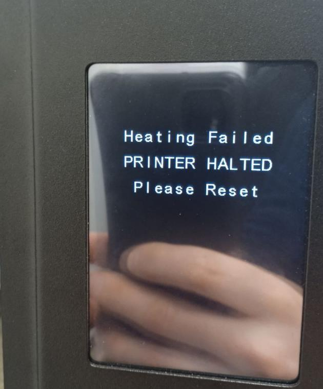

Пособие новичку.

Привет тебе юный падаван, поздравляю с покупкой твоего Ghost 6.  Тут мы разберем твои первые шаги с твоим новым принтером и постараемся чтобы твоя голова не взорвалась от новых знаний и ты не сделал ошибок ну или хотя бы сделал их как можно меньше.

1. собирать принтер по инструкции в случае нашего принтера можно и по книжке и по видео от летающих медведей, там достаточно просто и думаю дополнительных сложностей не возникнет. 
2. печать тестовой модели - это важно для проверки работоспособности принтера, выявления заводских недочетов и пока ты не вносил изменения в принтер легко открыть спор с продавцом. в общении с ним очень часто просят "Number" толи продажи толи еще как только его не переведут. это наклейка взади принтера. смело используй фото наклейки в сообщениях. 
3. при печати обрати внимание чтобы не было скрипов посторонних. обрати внимание на экран, он не должен моргать, хотя отзывчивостью родной экран не страдает но кнопки должны нажиматься там где они расположены. после печати аккуратно коснись мотора экструдера. если он как кипяток то поздравляю. тебе есть куда приложить руки. теперь тебе предстоит открутить правую боковую крышку закрепленную на 10 болтов и вытянуть крышку вниз чтобы добраться до отсека электроники. вооружится мультиметром и начать изучать [**этот мануал**](potenciometr.md)
4. После регулировок  если все ранее прошло удачно ты можешь нарезать пару своих моделей в слайсере. мои рекомендации это CURA или PRUSA (не забудь вставить стартовый и конечный коды в свойствах принтера.). совет: не гонись за скоростью. 60 мм\сек вполне нормально для стокового состояния принтера. отпечатай пару дней, не меняя настроек внутри принтера.  Данная рекомендация для того чтобы выявить родные болячки чтобы можно было с честным лицом общаться с продавцом в случае каких либо проблем с железом.  если они появятся то вероятнее всего для этого хватит 10-15 часов печати. не волнуйся почти все их можно решить самостоятельно, но ведь хочется и бесплатно)  поэтому не бойся в случае проблем писать продавцу и прикладывать фото.
5. поменять (или хотя бы проверить) тефлоновую трубку в термобарьере, с завода она может быть короче чем надо, в результате пластик начинает выдавливать ее вверх, образую внизу пробку, которую мотор экструдера не в состоянии продавать (характерный признак - щелчки в экструдере как будто происходят откаты и рваный пластик на моделе). У трубки не должно быть возможности двигаться вверх или вниз при установленном моторе экструдера. Начать можно с трубки, которая длиннее штатной на 1 сантиметр, постепенно подрезаяя ее и пытаясь усадить мотор экструдера на место (чтобы винты входили в боковые отверстия), допустимо небольшое усилие (преднатяг, так сказать), но не слишком большое, чтобы трубка сама по себе не замялась. Подходит любая стандартная из ближайшего магазина с 3д принтерами. Отрезать строго перпендикулярно, стараясь не деформировать форму канала.
6. для того чтобы начать печатать необходимо откалибровать размер откатов. на стоковом они огромные и примерные значения это где то 2 мм +- но откалибровать не помешает. сделать это лучше [тут](https://k3d.tech/calibrations/retractions/) или [тут](http://retractioncalibration.com/)
7. вероятнее всего именно в эти дни ты увидишь такую надпись на экране:
   
   

 не пугайся, у тебя просто умер термистор так как он самое слабое место в комплектации нашего принтера. теперь тебе предстоит освоить следующее умение - разбор головы фидера и термистора. очень советую перд этим прочитать раздел [**Что купить**](../what_2_buy/readme.md) и инструкцию по сборке и разборке головы [тут](https://fb-waiters.bibirevo.net/hardware/fbg6/bimetall)

7. после замены термистора, а общая рекомендация это не брать тот же самый, а купить и поставить 3950 100к  и горло биметалл которое позволит уменьшить откаты, теперь нам необходимо поставить прошивку получше того стокового недоразумения от медведей.  идем [сюда](../marlin/readme.md) или сюда(Гит паши). качаем устанавливаем по инструкции  делаем PID ехтрудера PID  стола. калибруем откаты тут](https://k3d.tech/calibrations/retractions/) и настраиваем LA [тут](https://k3d.tech/calibrations/la/) 
8. если ты молод душой и хочешь пользоваться всеми возможностями принтера которые можно получить в 21 веке то тебя ждет увлекательная установка клиппера. на данный момент для этого не надо быть супер умным, достаточно просто повторять инструкции которые написаны на русском мной). ничего сложного нет, хотя понадобятся небольшие финансовые траты. в разделе [**Что купить**](../what_2_buy/readme.md) ты найдешь подробный список комплектующих и не забудь купить акселерометр это необходимо для продвинутого алгоритма Input shaping который улучшит твое качество печати и скорость.  если ты не хочешь ставить клиппер а воспользоваться алгоритмом очень хочется то можно его попробовать настроить вручную. для этого советую посмотреть видео от Дмитрия Соркина [вот это](https://www.youtube.com/watch?v=ZFPkfZEB-XU) хотя оно для клиппера  найду для марлина - вставлю.
9.  Конечно мой совет будет переходить на клиппер. и этот гит с модификациями этому подтверждение, почитай статьи просто как художественную литературу, в будущем это поможет тебе избрать направления модификаций, найти нужные именно тебе, принять взвешенное решение и оценить обьем работы. не торопись прочитав одну статью. к результатам можно прийти несколькоми путями и на данном гите есть разделы которые предоставят ьебе их если не все, то несколько возможных.

10. Руководство по устранению неполадок качества печати посмотреть можно [тут](https://www.simplify3d.com/resources/print-quality-troubleshooting/)

11. Про датчик огня. в штатной прошивке для сработки надо выполнить 2 условия, температура хотенда выше 270 и засветка датчика. если в переводе на человеческий " пожар был потушен путем полного выгорания" ))) поэтому не стоит класть  тлеющую бумагу в принтер для проверки сработки и свечки ставить туда же, как и надеятся что если что принтер разберется сам. контроль за принтером нужен, и огнетушитель даже если он никогда в жизни не понадобиться стоит купить. 

Удачи тебе на пути к совершенству юный падаван!
