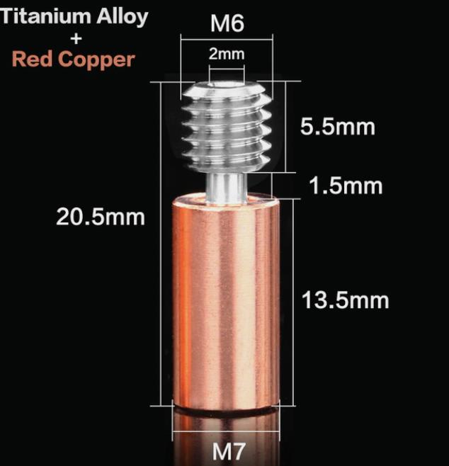
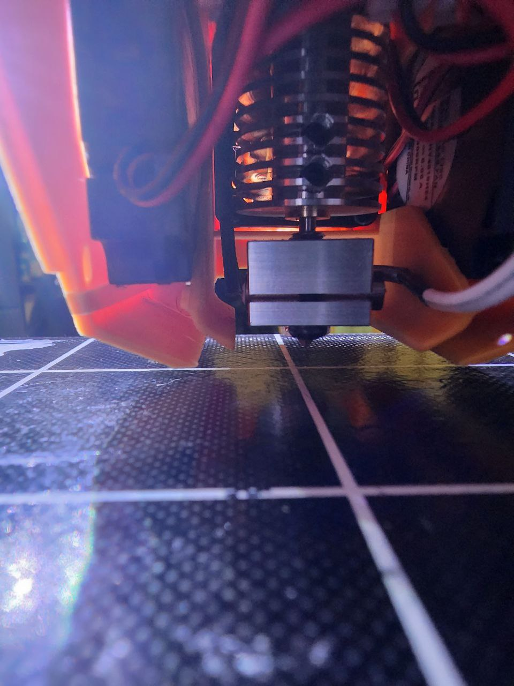
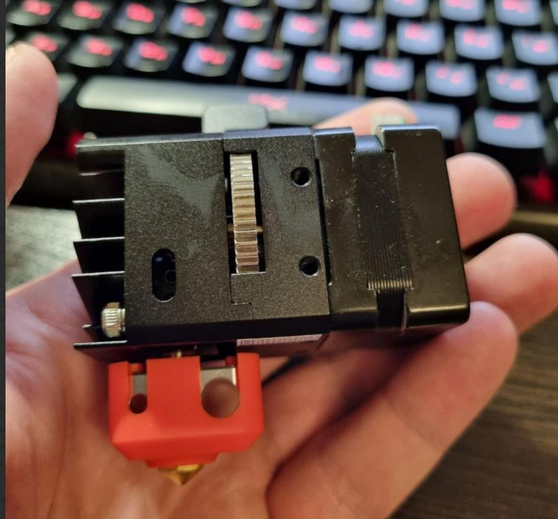

**Что купить.**

Перед каждым владельем принтера встает вопрос что купить для исправления известных косяков китайского чуда техники, что нужно для лучшей печати и что необязательно. универсального ответа не существует, так как финансовые возможности у всех разные и цели покупки тоже. рассмотрим несколько вариантов для возможного апгрейда. также я постараюсь пояснить что и для чего.

**Must have** *обязательный набор*
1. сопло и термобарьер - он же горло. В комплекте с принтером на данный момент поставляется довольно странный выбор, в стандартный блок V6 воткнули  сопло MK8  сквозной стальной термобарьер. чем плохо это решение? тем что на температурах более 250 трубка внутри достаточно быстро деградирует, а учитывая её качество и с гораздо меньшими температурами. Толстое горло слишком хорошо проводит тепло и шанс словить пробку даже на PLA достаточно высокий. Что делать? заменить горло на биметаллическое или титановое, но тут возникает диллема, радиатор тоже далек от стандарта и у нас возникает 2 выбора, купить высокое гладкое 17мм основание или короткое с основанием 13.5 мм, длинное придется подпиливать на 2 мм, а короткое высунуть на 2 мм, потому, что сопло нужно сменить на e3dv6 у которого более длинная резьба и оно идеально стыкуется с горлом внутри хотенда. мой выбор короткое горло [тут](http://alii.pub/6i45v0) и сопло  [тут](http://alii.pub/6i45y4) сопла обычно надо 0.4 и для технички 0.6  выглядит горло так   

после установки будет выглядеть так 

3. **Адгезив**. конечно опытные 3д печатники прекрасно знают кучу рецептов и тут мои советы совершенно излишни, мне понравились адгезивы от  https://fdmartel.ru Есть несколько температурных градаций, хорошие наборы. 
4.  **Термисторы, Нагреватели** Если вы опытный печатник, то вы тут вообще делаете? листайте ниже), эти советы не вам.  если неопытный, поверьте, термисторы и нагреватели это такой же  расходник как и пластик и желательно иметь запас, в стоке стоят  термисторы [ATC Semitec 104NT-4-R025H42G купить](https://www.ozon.ru/product/termistor-atc-semitec-104gt-2-v-gilze-ot-trianglelab-618437315/?from=share_android&sh=ZFl2bVhSMQ&utm_campaign=productpage_link&utm_medium=share_button&utm_source=smm&from=share_android) но я рекомендую простые 3950 например [тут](http://alii.pub/6i45pr) и нагреватели 40 -50 ватт например [тут](http://alii.pub/6i45p6)
5.  **Силиконовый носок** Как мы жили без них? плохо жили, обмотки каптоновым скотчем.. брр.. сейчас проще - покупаем вид v6 [тут](http://alii.pub/6i4618) Сколько? да сколько не жалко, запас карман не тянет, а стоят они недорого.
6. В стоке родная коса проводов от корпуса к фидеру идет в пластиковой гофре, она тяжелая, скрипучая и неудобная, меняем ее на [эту](http://alii.pub/6i479y) вид - 10мм

6. **Трубка PTFE** расходник. если будете менять горло и чуть ошибетесь с подрезкой родной трубки тоже пригодится купить можно [тут](http://alii.pub/6i47x3)
7. В процессе использования принтера нам необходимо его обслуживать и откручивать закручивать множество винтиков. К сожалению многие из них сделаны из марки стали "пластилин М3" да и потеряться, закатиться такая мелочь ой как любит, рекомендую купить [такой](http://alii.pub/6i48k8) набор чтобы компенсировать данное неудобство.

8.  А в общем то и всё. можете мне написать, что я забыл но для старта печати вам в общем-то ничего больше и не надо. кроме пластика конечно. но вы же только положили в корзинку и увидели что траты совсем небольшие и готовы продолжать? ну тогда переходим в раздел:

**Аdvanced** *продвинутый от начального*

 В этом разделе будут товары которые необязательно покупать но которые существенно или не очень улучшают принтер вне зависмости от прошивки. Например:

   1. **кулера обдува модели** [4010 от gdstime](http://alii.pub/6i49f5) нам нужны dualball на 24 вольта существенно тише штатных и за счет увеличенного количества оборотов в минуту более производительные.
   2. **heatblock V6** не штатный порошковый, а нормальный фрезерованный алюминий [купить тут](http://alii.pub/6i49pu)
   3. **Сушилка для пластика** Тот же PetG может сильно набирать влагу и после этого нормально печатать им просто не получится как бы вы не играли с настройками. [купить можно тут](http://alii.pub/6i4a39)
   4. **Дихлорметан** достаточно ядовитый растворитель но незаменим для обработки PLA и PetG пластиков [купить можно тут](https://market.yandex.ru/offer/adM95eCRRXghq39tuy6s3Q?utm_campaign=processing_email_old_notfollow&utm_source=email&utm_medium=trigger&utm_referrer=620&eh=b7f32770f214f23a33404650d59f52c6&ecid=processing&clid=620&pokupki=1&cpa=1)
   5. **Основание Fr4** на замену ультрабазе и для печати пластками типа нейлона но также подходящее и для остальных можно купить [такой текстолит](http://alii.pub/6i4ayk). нарезан уже в размер мишкиного стола.
   6. **Щетки очистки сопла** можно использовать как напрямую так и сделать автоматическую чистки из моего [мануала тут](../clean_nozle/readme.md) купить- [тут](http://alii.pub/6hz9dc)
   7. **подшипники оси Z LMK12LUU** Судя по количествам рекламаций скоро этот пункт переедет в категорию обязательно к покупке, но пока статистики недостаточно. [купить тут](http://alii.pub/6i4w92) если на модели дефекты похожие на следующее фото стоит присмотреться как у вас работают эти подшипники, ну или хотя бы смазать) ![дефект фото]
   8. **Линейные втулки LM8LUU, 8 мм, 8 на 15 на 45 мм** по сообщениям сообщества есть случаи больших зазоров в линейных подшипниках на осях. я решил убить 2 зайцев одной заменой и не только заменить подшипники но и облегчить общий вес кинематики за счет замены на [пластиковые втулки](http://alii.pub/6i4hql) насколько это решение было правильное покажет время. брал серые.
   9. **Смазка для линейных подшипников** ох и спорный пункт, не в том, что нужна ли смазка или нет, но сколько же копий ломается  в чатах о том, какая именно она должна быть. я решил дать ссылку от производителя принтеров, какую уж покупать решите сами. [вот ссылка](https://aliexpress.ru/item/1005003723700768.html)
   
   
**Klipper begginer**

  Для современной печати первое что нужно понять что марлин был хорош, но он уже сдает свои позиции и верятнее всего никогда уже не отыграет их назад, чтобы воспользоваться всеми достижениями прогресса необходима прошивка **klipper**. Апалогетов этой прошивки сейчас на каждом канале и почти у любого ютубера есть видео о ее достоинствах и фишках. в данном мануале нам важно что многие вещи возможны только на ней и многие вещи нам нужны будут только для этой прошивки, в первую очередь для различных подключений,  с учетом возможностей которые дает эта прошивка. 
  
   Как в сказке начинают от печки мы начнем с блока питания. 
   рекомендую перейти в раздел [placement](../placement/readme.md) и посмотреть на вариант реализации размещения внутри принтера. не испугались и даже выписали ссылки? ну и чудненько, читаем дальше. Из вариантов питания можно еще купить  [понижайку на 3 ампера с 24 до 5 вольт](http://alii.pub/6i4dya), но мой вам совет, купите нормальный блок питания для одноплатника.  
   Итак нам потребуется:
   1. **одноплатный компьютер** он же апельсинка, малинка, пишка, хост, "он же Гога он же Гоша"(с) на данный момент малинка raspberry стоит неадекватно денег поэтому народный выбор это Orange pi 3 lts которая  спокойно держит необходимые требования обладает кучей достоинств и практически не имеет недостатков учитывая ее цену. [купить тут](http://alii.pub/6i4egk)
   2. **радиаторы охлаждения** [купить тут](http://alii.pub/6i4ejh) Многие могут сказать что работает и так и можно поставить обдув рядом но я вспомню фразу М. Ю. Жванецкого "врачи у нас лечат и так, но лучше заплатить"(с) 
   3. **набор проводов dupont** не надо в меня кидать сразу тапки, да это временное соединение и на постоянное его использовать советовать не буду но многие используют и в качестве проверки работоспособности они незаменимы, ну а если добавить пару капель из термопистолета то и на постоянное сойдет. купить хороший набор [можно тут](http://alii.pub/6i4fzs)
   4. **наборы разьемов** [XH2.54 набор ](http://alii.pub/6i4g7d),  и инструмент для [обжима](http://alii.pub/6i4ggb)
   5. **провода тонкие** я брал [тут](http://alii.pub/6i4goo) косу по 10 и три метра. пригодились при подключении акселерометра. почитать можно [тут](../adxl345_2_mcu/readme.md)
   6. **акселерометр ADXL345** [брал тут](http://alii.pub/6i4hje)
   7. **светодиодная лента** самый дешевый и эффективный вариант на данный момент это 144 диода на метр при питании от 5 вольт [купить тут](http://alii.pub/6i4gz6) почитать о подключении можно [тут](../led_rgb/readme.md)
   8. **Экран 7 дюймов** на замену. я наверное один из первых кто запустил родной экран мишки как klipperscreen и могу с уверенностью вам сказать что оно того не стоит, трудность установки, танцы с бубном вокруг подключения и конфигурирования,  не дадут вам удовлетворения из-за отвратительного качества резистивного экрана с плохим откликом и жуткими артефактами. не мучайте дохлую лошадь - слезьте и купите хороший экран с быстрым и простым подключением легкой настройкой, а главное полноценным использованием для чего все это и затевалось. поверьте тому человеку который прошел все стадии принятия от торга до гнева и депрессии) [купить дешево тут](http://alii.pub/6i4irx) и уж точно дешевле вашего потраченного времени и сил в битве со стоковым экраном. 
   
      модельку под    него можно скачать [тут](https://www.thingiverse.com/thing:5629418)

   9.  **акриловый колпак** это самый удобный вариант монтажа экрана. купить [тут](http://alii.pub/6i4m86)
   10. **Вебкамера** Это наверое один из самых сильных аргументов который подвиг меня на установку klipper. Возможность записывать таймлапсы, следить за печатью не подходя к принтеру. Основной параметр при покупке - `mjpeg-streamer`  это почти все камеры, дальше на вкус и кошелек, я взял logitech c270 сейчас их лучше искать на авито или вообще подобрать вариант на али с модулями и распечатать на них корпус. также важным качеством для камеры будет угол обзора, я вышел из положения докупив [линзы](http://alii.pub/6i4vxs), более правильным вариантом будет подбор модуля камеры уже сразу с широким углом, от 120 градусов.
   
   **ULTIMATE**  раздел в разработке.

   Один из самых основных недостатков мишки 6 это огромные для директа ретракты. люфт шестерни, неправильная геометрия задника фидера, неправильный модуль шестерен это все равно только половина проблемы, даже замена фидера все равно оставляет порядка 70-80мм от шестерен до кончика сопла. Если хочется печатать флексами то это будет боль и страдания с черепашьими скоростями поэтому как говорили индейцы: если лошадь сдохла -слезь. можно загнать ладу семерку в автоцентр компании лотус, но после этого мы получим все равно ладу, аэродинамику и вес кирпича. так и здесь. переделывать фидер можно, менять моторы на более легкие.. но главный недостаток это не изменит.  на данный момент есть несколько решений и одно из них это [**BIQU H2 v2**](https://alii.pub/6ib1vi), хоть и не новое но проверенное  имеющее самые лестные отзывы от известных топовых блогеров. малый вес, компактность и главное прекрасные характеристики при печати флексами, а значит и остальными пластиками выводят этот экструдер в неоспоримый топ. при покупке я основывался на обзорах [Дмитрия Соркина](https://www.youtube.com/c/SorkinDmitry) на  [этом](https://youtu.be/2bxKz0nOVpY) сравнении и [обзоре предыдущей версиии](https://youtu.be/n_B7iGDqVm0) экструдера.  

   модель каретки  для печати можно [скачать по ссылке](../karas/readme.md)
   
   

  
